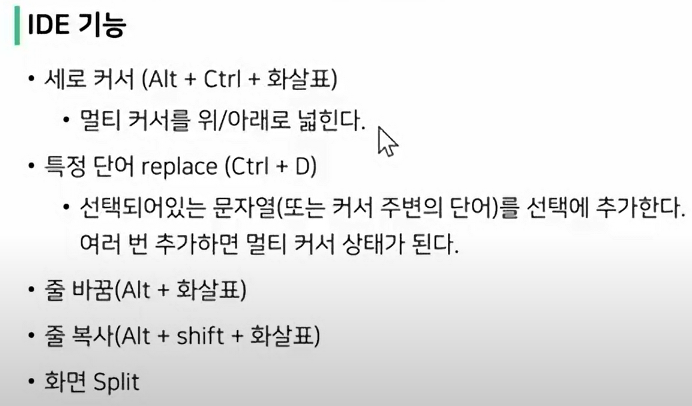
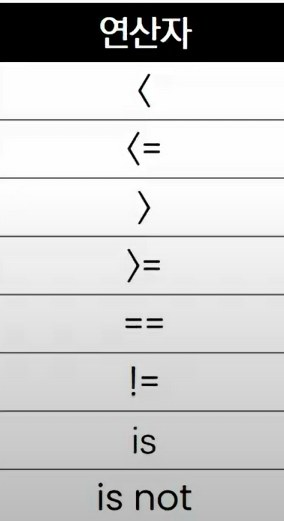
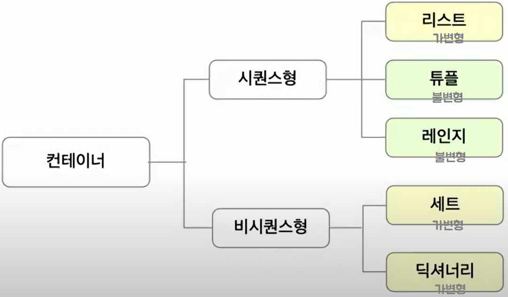

## 일정

| 월         | 화            | 수          | 목            | 금            |
| ---------- | ------------- | ----------- | ------------- | ------------- |
| 라이브강의 | 오프라인 실습 | 라이브 강의 | 오프라인 실습 | 오프라인 실습 |
| 중식       | 중식          | 중식        | 중식          | 중식          |
| 화상미팅   | 오프라인 실습 | 화상미팅    | 오프라인 실습 | 오프라인 실습 |
| 라이브강의 | ''            | 라이브강의  | ''            | ''            |
| 화상미팅   | ''            | 화상미팅    | ''            | ''            |


## 개념 구조화 하기

- 프로그래밍에서 개념을 명확히 알고, 그것을 구조화하는 것이 중요!


Q.구조화란?

A.어떠한 개념이 있으면,

해당 개념과 하위 개념들을 잘 묶어서

머릿속에 저장하는 것.

마치 정리가 잘 된 서랍처럽!


## 개념 구조화 하기 in 프로그래밍

개념 구조화

- 개념의 정의
- 개념의 포함 관계 (동물 - 포유류, 파충류, ...)
- 두 개념의 차이점(그래프 vs 트리)

그때그때 정리를 합시다! (기술면접에 도움이 됩니다.)


집으로 길 찾기처럼 자연스럽게!


## 기본기 탄탄하게 쌓기

물에 빠지지 않고 수영 배우기

= 코드를 작성하지 않고, 프로그래밍 배우기


조금 지루하더라도, 기본기가 중요!


기본 개념들을 연습할 수 있는 기본문제들을 많이 풀어보기


## 동료 학습 (Peer Learning)

상호작용을 기반으로 한 학습

- 친구에게 배운 개념 설명하기
- 친구 코드의 에러 함께 해결하기
- 모르는 내용을 서로 질문/대답하면서 지식의 빈틈 채우기


## 동료 학습(Peer Learning)의 장점

- 현업 기반의 학습 환경
- 실제 회사에서도 함께 일하게 됨
- 커뮤니케이션 스킬이 증진

동료 학습 good == 취업 good


---

# 프로그래밍이란?

## 프로그래밍의 정의

프로그래밍 (**program**ming)


-> 프로그램을 만드는 행위

(프로그램 + ing)


프로그램이란?

특정 작업을 수행하는 일련의 명령어들의 모음

컴퓨터가 해야 할 일들의 모음

프로그래머 : 프로그램을 만드는 사람(소프트웨어 개발자)

소프트웨어 : 엄밀히 따지면 다르지만, 프로그램과 유사한 의미로 사용

코딩 : 엄밀히 따지면 다르지만, 프로그램과 유사한 의미로 사용

- 


## 프로그래밍의 원리

- 프로그래밍 언어란?

  - 컴퓨터는 기계어로 소통!
  - 기계어란 ? 0과 1로 모든 것을 표현(2진법)

  - 처음 컴퓨터가 발명될 때 전기 신호로 전기가 들어왔는지 (1) , 들어오지 않았는지(0) 확인하는 방법으로 시작해서 지금까지 사용

  - 기계어의 대안으로 사람이 이해할 수 있는 새로운 언어 개발 -> **프로그래밍 언어**

    

- 소스 코드란?

  - 프로그래밍 언어로 작성된 프로그램

- 번역기란? (interpreter 혹은 compiler)
  - 소스 코드를 컴퓨터가 이해할 수 있는 기계어로 번역
  - 파이썬의 경우 인터프리터를 사용


## 파이썬을 배워야 하는 이유 1 - 알고리즘 코딩 테스트에 유리

- 알고리즘 코딩 테스트에서는 Python이 2위를 기록
- 코딩 테스트의 유형이 다양해지면서,
- 변칙적인 유형에 대응하기 쉬운 파이썬이 코딩 테스트에 유리, 그 결과 최근 3년간 파이썬이 급증
- 대회 준비를 위한다면 C를 추천
- 입사를 위한 코딩 테스트는 Python 추천 (알고리즘은 설계가 중요!)
  - IM
  - A (Adv)
  - B (Pro)
  - C (Expert)

## 파이썬을 배워야 하는 이유2 - 구현 코딩 테스트에 유리

- 유용한 라이브러리 중 최소한만 사용해 프로그램을 개발할 수 있어 가장 유리한 언어
- 실행 시간이 매우 중요한 문제 유형이 아닌 이상 파이썬으로 코딩테스트를 준비하는 것이 최선의 선택


## 파이썬을 배워야 하는 이유 3 - 가장 인기 많은 언어


프로그래밍 인기 척도로 사용하는 PYPL Index와 TIOBE Index에서 2022년 6월 1위

AI 개발, 데이터 분석, 웹 프로그래밍, 업무 자동화 등 파이썬 활용 분야가 늘어나서, 많은 회사에서 도입 중


---

# 파이썬의 특징

## Easy to Learn


파이썬은 다른 프로그래밍 언어보다 문법이 간결하고, 유연함

(변수에 별도의 타입 저장이 필요 없음)


비교적 쉽게 마스터하고, 프로그래밍 사고에 집중할 수 있음


## 인터프리터 언어(Interpreter)

파이썬은 소스 코드를 기계어로 변환할 때 통역(interpreter) 하듯이 1줄씩 변환


**객체 지향 프로그래밍(OOP)**

- 현대 프로그래밍의 기본적인 설계 방법론으로 자리잡은 객체 지향 프로그래밍
- 파이썬은 객체 지향 언어이며, 모든 것이 객체로 구현되어 있음


## 파이썬 개발 환경 종류

- IDE(Intergrated development environment)

  - 통합 개발 환경의 약자로 개발에 필요한 다양하고 강력한 기능들을 모아둔 프로그램
  - 보통 개발은 IDE로 진행함 (VScode,Pycharm)

- Jupyter Notebook ([설치](https://abit.ly/ssafy8-document))

  - "Jupyter Notebook 설치", "Chrome 프로그래밍 폰트 적용"

  - 문법 학습을 위한 최적의 도구로, 소스 코드와 함께 실행 결과와 마크다운 저장 가능
  - open source 기반의 웹 플랫폼 및 어플리케이션으로, 파이썬을 비롯한 다양한 프로그래밍 언어를 지원하며 셀 단위의 실행이 가능한 것이 특징

- 코딩
  - 파이썬: Jupyter & VSCode
  - 웹: VSCode (HTML/CSS,Django,Javascript,Vue 등 모두 개발하기 편한 환경)
  - 알고리즘 : Pycharm

- 단축키

ALT+Shift+화살표 : 복사




## 파이썬 코드 작성법

> 코드스타일 가이드 (*코드의 가독성에 영향을 줍니다*)

- 코드를 '어떻게 작성할지'에 대한 가이드라인

- 파이썬에서 제안하는 스타일 가이드(강의에서 사용)

  -[PEB8](https://python.org/dev/peps/pep-0008/)


> 들여쓰기

- Space Sensitive

  4칸 Space or 1 Tab (혼용금지)


> 주석(Comment)

- 코드에 대한 설명
  - 코드를 보다 이해하기 쉽게 하여 분석 및 수정 용이해짐
  - 주석은 코드에 영향을 주지 않으며, 오로지 개발자를 위한 것
- 초기부터 들여야 할 가장 중요한 습관
  - 개발자에게 주석을 다는 습관은 매우 중요
  - 주석은 실행에 영향을 미치지 않을 뿐만 아니라
  - 프로그램의 속도를 느리게 하지 않으며, 용량을 늘리지 않음


> 한 줄 주석 (#)

- 한 줄 주석
  - 주석으로 처리될 내용 앞에 '#'을 입력

> 여러 줄 주석 (Ctrl + / ,```)


> 주석의 장점

- 개발자에게 주석을 다는 습관은 매우 중요
  - 코드의 내용을 잘 이해할 수 있도록 작성
  - 가독성을 저해할 정도로 무분별한 사용은 자제
- 코드를 쉽게 이해할 수 있어서 코드 수정 및 협업에 유리


> 변수(Variable)

- 변수란?
  - 데이터를 저장하기 위해서 사용
  - 변수를 사요하면 복잡한 값들을 쉽게 사용할 수 있음(추상화)
    - 추상화(변수를 사용해야 하는 이유)
    - (2000*5) 실행하면 결과는 잘 나오지만, 일일이 값을 넣는 것이 불편함, 코드를 알아보기 힘듦, 고치기 어려운코드... 만약 아메리카노가 2000->2500원으로 바뀐다면?
    - ~~(2000*5)~~--> americano_price=2000,  americano*5


- 동일 변수에 다른 데이터를 언제든 할당(저장)할 수 있기 때문에, '변수'라고 불림

> 각 변수의 값을 바꿔서 저장하기

- 방법1

  ``` python
  x, y = 10, 20
  
  tmp = x
  x = y
  y = tmp
  print(x, y) # 20 10
  ```

  

- 방법2

```python
x, y = 10, 20

y, x = x, y
print(x, y) # 20 10
```


> 식별자

- 변수 이름 규칙

  - 식별자의 이름은 영문 알파벳, 언더스코어(_), 숫자로 구성

  - 첫 글자에 숫자가 올 수 없음

  - 길이 제한이 없고, 대소문자를 구별

  - 다음의 **키워드**는 예약어로 사용할 수 없음

  - ``` python
    import keyword
    print(keyword.kwlist)
    
    # 출력 결과
    ['False', 'None', 'True', '__peg_parser__', 'and', 'as', 'assert', 'async', 'await', 'break', 'class', 'continue', 'def', 'del', 'elif', 'else', 'except', 'finally', 'for', 'from', 'global', 'if', 'import', 'in', 'is', 'lambda', 'nonlocal', 'not', 'or', 'pass', 'raise', 'return', 'try', 'while', 'with', 'yield']
    ```

  - **내장 함수**나 **모듈** 등의 이름도 사용하지 않아야 함 (심지어 파일 이름에서도 사용하면 안됌. print는 모듈(파일)의 이름)

  - 동작을 예상할 수 없게 임의로 값을 할당하게 되므로 범용적이지 않은 코드가 됨

  - ```python
    print(5)
    print = 'hi'
    print(5) # 에러 발생 (TypeError: 'str' object is not callable)
    
    # 내장 함수 print가 아닌, 문자열 hi가 할당된 변수 print로 사용됨
    ```


> 연산자


> 연산자 우선순위

- 기본적으로 수학에서 우선순위와 같음
- 괄호가 가장 먼저 계산되고, 그 다음에
  - 곱하기(*)와 나누기(/)가
  - 더하기(+)와 빼기(-)보다 먼저 계산됨

---


> 자료형(Datatype) 분류

- 프로그래밍에서는 다양한 종류의 값(데이터)를 쓸 수 있음
  - 사용할 수 있는 데이터의 종류들을 자료형(Datatype)이라고 함


> 수치형 자료형 표현

- 정수 자료형표현, 진수표현, 실수 자료형(float)


> 실수 연산시 주의할 점(부동 소수점)

- 실수의 값을 처리할 때 의도하지 않은 값이 나올 수 있음

- ```python
  print(3.2 - 3.1) # 0.10000000000000009
  print(1.2 - 1.1) # 0.09999999999999987
  ```

- 연산의 결과가 0.1이 아니다!

- 컴퓨터는 2진수를 사용, 사람은 10진법을 사용
- 이때 10진수 0.1은 2진수로 표현하면 0.00011001100110011...
- 계산 결과가 위와 같이 예상치 못한 결과가 나타나면 이를 Floating point rounding error 라고 합니다.


> 실수 연산시 주의할 점 - 해결책

- 값 비교하는 과정에서 정수가 아닌 실수면 주의할 것
  - 매우 작은 수보다 작은지를 확인하거나 math 모듈 활용

```python
# 1. 임의의 작은 수 활용
print(abs(a - b) <= 1e-10) # True (1e-10 : 입실론)

# 2. python 3.5 이상
import math
print(math.isclose(a,b)) # True
```


> 진수 표현

- 여러 진수 표현 가능
  - 2진수(**b**inaty) : 0b
  - 8진수(**o**ctal) : 0o
  - 16진수(he**x**decimal) 0x  *16진수는 2진수 4자리를 표현 (16진수 2자리는 1바이트 = 8비트)*


---

> 문자열 자료형의 정의

- 모든 문자는 str 타입
- 문자열은 작은따옴표(') 나 큰따옴표(")를 활용하여 표기
  - 문자열을 묶을 때는 동일한 문장부호를 활용
  - PEP8에서는 소스코드 내에서 하나의 문장부호를 선택하여 유지하도록 함 (작은따옴표를 쓸 거면 계속 사용해라)


> 중첩 따옴표

- 따옴표 안에 따옴표를 표현할 경우

  - 작은따옴표가 들어 있는 경우는 큰따옴표로 문자열 생성
  - 큰따옴표가 들어 있는 경우는 작은따옴표로 문자열 생성

  

> 역슬래시(backslash)뒤에 특정 문자가 와서 특수한 기능을 하는 문자 조합


> 문자열 연산

- 덧셈

  ```python
  print("Hello" + "World") # HelloWorld
  ```

  

- 곱셈

  ```python
  print("Python" * 3) # PythonPythonPython
  ```

  

> String InterPlation (문자열을 변수를 활용하여 만드는 법)

- %-formatting

  ```python
  name = 'Kim'
  score = 4.5
  
  print('Hello, %s' %name) # Hello, Kim
  print('내 성적은 %d' %score) # 내 성적은 4
  print('내 성적은 %f' %score) # 내 성적은 4.500000
  
  ```

- str.format()

  ```python
  name = 'Kim'
  score = 4.5
  
  print('Hello, {}! 성적은 {}'.format(name,score))
  # Hello, Kim! 성적은 4.5
  ```

- ★☆★☆ f-strings : python 3.6  ★☆★☆ 빠르고 편리

  ```python
  name = 'Kim'
  score = 4.5
  
  print(f'Hello, {name}! 성적은 {score}')
  # Hello, Kim! 성적은 4.5
  ```

  

- datetime 날짜, 시간 모듈

  ```python
  import datetime
  today = datetime.datetime.now()
  print(today) # 2022-07-08 16:04:15.200411
  
  print(f'오늘은 {today: %y}년 {today: %m}월 {today:%d}일')
  # 오늘은 22년 07월 08일
  ```

  

- 원주율

  ```python
  pi = 3.141592
  print(f'원주율은 {pi:.3}. 반지름이 2일 때 원의 넓이는 {pi*2*2}')
  # 원주율은 3.14. 반지름이 2일때 원의 넓이는 12.566368
  ```

  

  

> None

- 파이썬 자료형 중 하나
- 값이 없음을 표현하기 위해 None 타입이 존재
- 일반적으로 반환 값이 없는 함수에서 사용하기도 함


> 불린형(Boolean)이란?

- 논리 자료형으로 참과 거짓을 표현하는 자료형
- True 또는 False 를 값으로 가짐
- 비교 / 논리 연산에서 활용됨


> 비교 연산자

- 수학에서 등호와 부등호와 동일한 개념
- 주로 조건문에 사용되며 값을 비교할 때 사용
- 결과는 True / False 값을 리턴함



> 비교 연산자 활용 예시

``` python
print(3 > 6) # False
print(3.0 == 3 ) # True
print(3 >= 0) # True
print('3' != 3) # True
print('Hi' == 'hi') # False
```


> 논리 연산자

- 여러 가지 조건이 있을 때

  - 모든 조건을 만족하거나(And), 여러 조건 중 하나만 만족해도 될 때(Or) 특정 코드를 실행하고 싶을 때 사용
  - 일반적으로 비교연산자와 함께 사용됨

  | 연산자  | 내용                           |
  | ------- | ------------------------------ |
  | A and B | A와 B 모두 True시, True        |
  | A or B  | A와 B 모두 False시, False      |
  | Not     | True를 False로, False를 True로 |

  ```python
  num = 100
  print(num >= 100 and num % 3 == 1) # True
  ```

  

> 논리 연산자 사용 예시

```python
print(True and True) # True
print(True and False) # False
print(False and True) # False
print(False and False) # False

print(True and True) # True
print(True and False) # True
print(False and True) # True
print(False and False) # False

# 23시가 되었고, 잠이 오는 경우
hour = 23
status = 'sleepy'
print(hour >= 22 and status == 'sleepy') # True

# 23시가 되었지만, 잠이 안 오는 경우
hour = 23
status = 'nice'
print(hour >= 22 and status == 'sleepy') # False
```


> 논리 연산자 주의할 점 / not 연산자

- Falsy : False는 아니지만 False로 취급 되는 다양한 값

  - 0, 0.0, (), [], {}, None, ""(빈 문자열)

- 논리 연산자도 우선순위가 존재

  - not, and, or 순으로 우선순위가 높음

  ```python
  print(not True) # False
  print(not 0) # True
  print(not 'hi') # False
  print(not True and False or not False) # True
  # 위와 같음
  print(((not True) and False or (not False)))
  ```

  

> 논리 연산자의 <u>단축 평가</u>

- 결과가 확실한 경우 두번째 값은 확인하지 않고 첫번째 값 반환
- and 연산에서 첫번째 값이 False인 경우 무조건 False => 첫번째 값 반환
- or 연산에서 첫번째 값이 True인 경우 무조건 True => 첫번째 값 반환
- 0dms False, 1은 True

```python
print(3 and 5) # 5
print(3 and 0) # 0
print(0 and 3) # 0
print(0 and 0) # 0

print(5 or 3) # 5
print(3 or 5) # 3
print(0 or 3) # 3
print(0 or 0) # 0

a = 5 and 4
print(a) # 4

b = 5 or 3
print(b) # 5

c = 0 and 5
print(c) # 0

d = 5 or 0
print(d) # 5
```


## 컨테이너(자료구조)

> 컨테이너란?

- 여러 개의 값(데이터)을 담을 수 있는 것(객체)으로, 서로 다른 자료형을 저장할 수 있음
  - 예시 : List
- 컨테이너의 분류
  - <u>순서가 있는 데이터 (Ordered)</u> vs <u>순서가 없는 데이터 (Unordered)</u>
  - 순서가 있다 != 정렬되어 있다.




> 리스트

- 리스트는 대괄호([]) 혹은 list()를 통해 생성

  - 파이썬에서는 어떠한 자료형도 저장할 수 있으며, 리스트 안에 리스트도 넣을 수 있음
  - 생성된 이후 내용 변경이 가능 -> 가변 자료형
  - 이러한 유연성 때문에 파이썬에서 가장 흔히 사용

- 순서가 있는 시퀀스로 인덱스를 통해 접근 가능

  - 값에 대한 접근은  list[i]

  ```python
  # 리스트명 = [요소1, 요소2, 요소3, ...]
  list_a = []
  list_b = [1, 2, 3]
  list_c = ['Life', 'is', 'too', 'short']
  list_d = [1, 2, 3, 'Python', ['리스트', '안에', '리스트']]
  ```


> 리스트의 생성과 접근 예시

```python
my_list = []
another_list = list()
print(type(my_list)) # <class 'list'>
print(type(another_list)) #<class 'list'>

location = ['서울', '대전', '구미', '광주', '부울경']
print(location) # ['서울', '대전', '구미', '광주', '부울경']
print(type(location)) # <class 'list'>
print(location(0)) # 서울
```


- 리스트는 담고 있는 요소를 바꿀 수 있다. -> 가변 자료형(mutable)

``` python
location = '양양'
print(location) # ['양양', '대전', '구미', '광주', '부울경']
```


---

> 튜플의 정의

- 튜플은 여러 개의 값을 순서가 있는 구조로 저장하고 싶을 때 사용
  - 리스트와의 차이점은 생성 후, 담고 있는 값 변경이 불가(불변자료형)
- 항상 소괄호 형태로 사용

```python
print((1, 2, 3, 1)) # (1, 2, 3, 1)
print(tuple((1, 2, 3, 1))) # (1, 2, 3, 1)
print(type((1, 2, 3, 1))) # <class 'tuple'>
```


> 튜플의 생성과 접근

- 소괄호 (()) 혹은 tuple()을 통해 생성
- 튜플은 수정 불가능한(immutable) 시퀀스로 인덱스로 접근 가능
- 값에 대한 접근은 my_tuple[i]

```python
# 값 접근
a = (1, 2, 3, 1)
print(a[1]) # 2

# 값 변경 => 불가능
a[1] = '3' # TypeError : 'tuple' object does not support item assignment
```


> 튜플(tuple) 생성 주의사항

- 단일 항목의 경우
  - 하나의 항목으로 구성된 튜플은 생성 시 값 뒤에 쉼표를 붙여야 함
- 복수 항목의 경우
  - 마지막 항목에 붙은 쉼표는 없어도 되지만, 넣는 것을 권장(Trailing comma)

```python
tuple_a = (1,)
print(tuple_a) # (1,)
print(type(tuple_a)) # <class 'tuple'>

tuple_b = (1, 2, 3,)
print(tuple_b) # (1, 2, 3)
print(type(tuple_b)) # <class 'tuple'>

a= 1,
print(a) # (1,)
print(type(a)) # <class 'tuple'>

b = 1, 2, 3
print(b) # (1, 2, 3)
print(type(b)) # <class 'tuple'>
```


> 튜플 대입(Tuple assignment)

- 튜플 대입이란 ?
  - 우변의 값을 좌변의 변수에 한 번에 할당하는 과정
- 튜플은 일반적으로 파이썬 내부에서 활용
  - 추후 함수에서 복수의 값을 반환할 때에도 활용

```python
x, y = 1, 2
print(x, y) # 1 2

# 실제로 tuple로 처리
x, y = (1, 2)
print(x, y) # 1 2
```


---

> Range의 정의

- 숫자의 시퀀스를 나타내기 위해 사용
- 주로 반복문과 함께 사용됨

```python
print(range(4)) # range(0,4)

# 담겨 있는 숫자를 확인하기 위하여 리스트로 형변환 (실제 활용시에는 형변환 필요 없음)
print(list(range(4))) # [0, 1, 2, 3]

print(type(range(4))) # <class 'range'>
```


> Range의 사용 방법

- 기본형 : range(n)
  - 0부터 n-1 까지의 숫자의 시퀀스
- 범위 지정 : range(n, m)
  - n부터 m-1까지의 숫자의 시퀀스
- 범위 및 스텝 지정 : range(n, m, s)
  - n부터 m-1까지 s만큼 증가시키며 숫자의 시퀀스

```python
# 0부터 특정 숫자까지
print(list(range(3))) # [0, 1, 2]

# 숫자의 범위
print(list(range(1, 5))) # [1, 2, 3, 4]

# step 활용
print(list(range(1, 5, 2))) # [1, 3]

# 역순
print(list(range(6, 1, -1))) # [6, 5, 4, 3, 2]

print(list(range(6, 1, -2))) # [6, 4, 2]

print(list(range(6, 1, 1))) # []
```

---


## 슬라이싱

> 시퀀스를 특정 단위로 슬라이싱

- 인덱스와 콜론을 사용하여 문자열의 특정 부분만 잘라낼 수 있음
- 슬라이싱을 이용하여 문자열을 나타낼 때 콜론을 기준으로 앞 인덱승 ㅔ해당하는 문자는 포함되지만 뒤 인덱스에 해당 문자는 미포함

```python
# 리스트([1:4]에서 1은 포함 4는 미포함)
print([1, 2, 3, 5][1:4]) # [2, 3, 5]

# 튜플
print((1, 2, 3)[:2]) # (1, 2)

# range
print(range(10)[5:8]) # range(5,8)

# 문자열
print('abcd'[2:4]) # cd
```


> 시퀀스를 k간격으로 슬라이싱

```python
# 리스트
print([1, 2, 3, 5][0:4:2]) # [1, 3]

# 튜플
print((1, 2, 3, 5)[0:4:2]) # (1, 3)

# range
print((range(10)[1:5:3])) # range(1, 5, 3)

# 문자열
print('abcdefg'[1:3:2]) # b
```


> 문자열 슬라이싱 예제

```python
s='abcdefghi'

print(s[2:5]) # cde

print(s[2:5:2]) # ce

print(s[5:2:-1]) # fed

print(s[:3]) # abc

print(s[5:]) # fghi

print(s[::-1]) # ihgfedcba <- s[-1:-(len(s)+1):-1]과 동일

print(s[::]) # abcdefghi   <- s[0:len(s):1]과 동일
```


---

> 셋 (Set)

- Set 이란 중복되는 요소가 없이, 순서에 상관없는 데이터들의 묶음
  - 데이터의 중복을 허용하지 않기 때문에 중복되는 원소가 있다면 하나만 저장
  - 순서가 없기 때문에 인덱스를 이용한 접근 불가능
- 수학에서의 집합을 표현한 컨테이너 (`합집합, 차집합, 교집합`)
  - 집합 연산이 가능(여집합을 표현하는 연산자는 별도로 존재x)
  - 중복된 값이 존재하지 않음
- 담고 있는 요소를 삽입, 변경, 삭제 가능 -> 가변 자료형 (mutable)


> 셋(Set) 생성

- 중괄호 ({}) 혹은 set()을 통해 생성
  - 빈 Set을 만들기 위해서는 set()을 반드시 활용해야 함
- 순서가 없어 별도의 값에 접근할 수 없음

```python
# Set는 중복 값 제거
print({1, 2, 3, 1, 2}) #{1, 2, 3}
print(type({1, 2, 3})) # <class 'set'>

# 빈 중괄호는 Dictionary
blank = {}
print((type(blank)) # <class 'dict'>
blank_set = set()
print(type(blank_set)) # <class 'set'>
      
# Set는 순서가 없어 인덱스 접근 등 특정 값에 접근할 수 없음
print({1, 2, 3}[0]) #TypeError: 'set' object is not subscriptable
```


> 셋(Set) 사용하기

- 셋을 활용하면 다른 컨테이너에서 중복된 값을 쉽게 제거할 수 있음
  - 단, 이후 순서가 무시되므로 순서가 중요한 경우 사용할 수 없음
- 아래의 리스트에서 고유한 지역의 개수는 ?

```python
my_list = ['서울', '서울', '대전', '광주', '서울', '대전', '부산', '부산']

print(len(set(my_list))) # 4
```


- 아래의 리스트에서 고유한 지역을 등장한 순서대로 출력하시오.

```python
my_list = my_list = ['서울', '서울', '대전', '광주', '서울', '대전', '부산', '부산']

# Set를 사용하는 순간 순서가 사라짐(실행 할 때마다 순서가 변경됨)
print(set(my_list)) # {'광주', '서울', '부산', '대전'}
```


> 셋(Set) 연산자

```python
A_set = {1, 2, 3, 4}
B_set = {1, 2, 3, 'Hello', (1, 2, 3)}

#합집합
print(A_set | B_set) # {1, 2, 3, 4, (1, 2, 3), 'Hello'}

#교집합
print(A_set & B_set) # {1, 2, 3}

#차집합
print(B_set - A_set) # {(1, 2, 3), 'Hello'}

#대칭차집합 (합집합 - 교집합)
print(A_set ^ B_set) # {4, (1, 2, 3), 'Hello'}

```


---

## 딕셔너리

> 딕셔너리의 정의

- 키-값(key-value) 쌍으로 이뤄진 자료형 (v3.7 부터는 ordered)
- Dictionary의 키(key)
  - key는 변경 불가능한 데이터(immutable)만 활용 가능
    - string, integer, float, boolean, tuple, range
- 각 키의 값(values)
  - 어떠한 형태든 관계없음


> 딕셔너리의 생성

- 중괄호({}) 혹은 dict()을 통해 생성
- key를 통해 value에 접근

```python
dict_a = {}
print(type(dict_a)) # <class 'dict'>

dict_b = dict()
print(type(dict_b)) # <class 'dict'>

dict_a = {'a': 'apple', 'b': 'banana', 'list': [1, 2, 3]}
print(dict_a) # {'a': 'apple', 'b': 'banana', 'list': [1, 2, 3]}
print(dict_a['list']) # [1, 2, 3]

dict_b = dict(a='apple', b='banana', list=[1, 2, 3])
print(dict_b) # {'a': 'apple', 'b': 'banana', list: [1, 2, 3]}
```


## 형변환(Typecasting)

> 형변환이란

- 파이썬에서 데이터 형태는 서로 변환할 수 있음
- 암시적 형 변환(Implicit) [파이썬 , 자동]
  - 사용자가 의도하지 않고, 파이썬 내부적으로 자료형을 변환하는 경우
- 명시적 형 변환(Explicit) [개발자, 의도]
  - 사용자가 특정 함수를 활용하여 의도적으로 자료형을 변환하는 경우


> 암시적 형 변환

- 사용자가 의도하지 않고, 파이썬 내부적으로 자료형을 변환 하는 경우

  - bool
  - Numeric type (int, float)

  ```python
  print(True + 3) # 4
  print(3 + 5.0) # 8.0
  ```

  

> 명시적 형 변환

- int

  - str, float => int
  - 단, 형식에 맞는 문자열만 정수로 변환 가능

  ```python
  # 문자열은 암시적 타입 변환이 되지 않음
  print('3' + 4) # TypeError: can only concatenate str (not 'int') to str
  
  # 명시적 타입 변환이 필요함
  print(int('3') + 4) # 7
  
  # 정수 형식이 아닌 경우 타입 변환할 수 없음
  print(int('3.5') + 5) # ValueError invalid literal for int() with base 10: ...
  
  print('3' + str(4)) # 34
  ```

  

- float

  - str(참고), int => float
  - 단, 형식에 맞는 문자열만 float로 변환 가능

  ```python
  print('3.5' + 3.5) # TypeError: can only concatenate str (not 'float') to str
  
  # 정수 형식의 경우에도 float로 타입 변환
  print(float('3')) # 3.0
  
  # float 형식이 아닌 경우 타입 변환할 수 없음
  print(float('3/4') + 5.3) # ValueError : could not convert string to float: ...
  ```

  

- str

  - int, float, list, tuple, dict => str

  ```python
  print(str(1)) # 1
  
  print(str(1.0)) # 1.0
  
  print(str([1, 2, 3])) # [1, 2, 3]
  
  print(str((1, 2, 3))) # (1, 2, 3)
  
  print(str({1, 2, 3})) # {1, 2, 3}
  ```

  

## 프로그램 구성 단위

- 식별자(identifier)

  - 변수, 함수, 클래스 등 프로그램이 실행되는 동안 다양한 값을 가질 수 있는 이름
  - 예약어
    - 파이썬 키워드 (명령어)

- 리터럴(literal)

  - 읽혀지는 대로 쓰여있는 값 그 자체

  ```python
  # name은 식별자, 즉 변수
  # '김싸피'는 리터럴
  name = '김싸피'
  ```

  

- 표현식 (Expression)
  - 새로운 데이터 값을 생성하거나 계산하는 코드 조각
- 문장 (statement)
  - 특정한 작업을 수행하는 코드 전체
  - 파이썬이 실행 가능한 최소한의 코드 단위
  - 표현식은 값을 생성하는 일부분이고, 문장은 특정작업을 수행하는 코드 전체

```python
# 하나의 값(value)도 문장이 될 수 있습니다.
'ssafy'

# 표현식 (expression)도 문장이 될 수 있습니다.
5 * 21 - 4

# 실행 가능(executable)해야 하기 때문에 아래의 코드는 문장이 될 수 없습니다.
name = ' # SyntaxError: EOL while scanning string literal
```

- 함수 (function)

  - 특정 명령을 수행하는 묶음

  ```python
  def multiply(x, y, z):
      return x * y * z
  
  numbers = [5, 6, 3]
  multifly(*numbers)
  ```

  

- 모듈 (Module)

  - 함수 / 클래스의 모음 또는 하나의 프로그램을 구성하는 단위

  

- 패키지 (Package)

  - 프로그램과 모듈 묶음
    - 프로그램 : 실행하기 ㅜ이한 것
    - 모듈 : 다른 프로그램에서 불러와 사용하기 위한 것

- 라이브러리 (Library)

  - 패키지 모음

  

