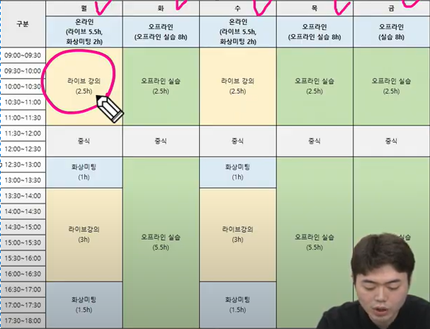
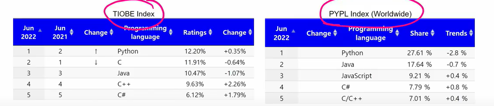
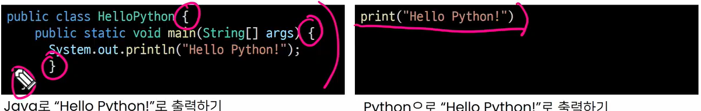
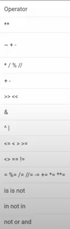
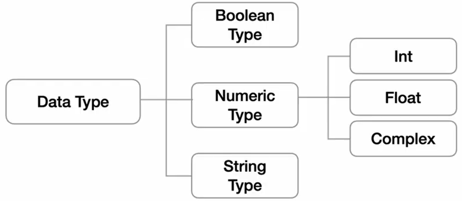
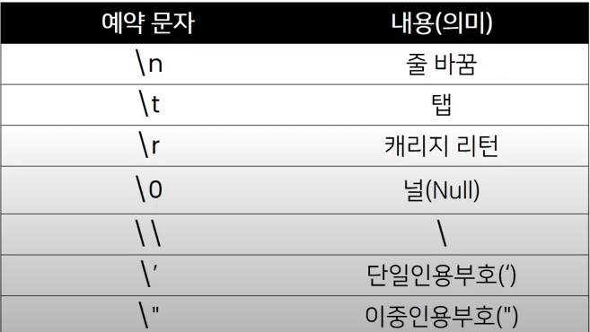

## 일정

| 월         | 화            | 수          | 목            | 금            |
| ---------- | ------------- | ----------- | ------------- | ------------- |
| 라이브강의 | 오프라인 실습 | 라이브 강의 | 오프라인 실습 | 오프라인 실습 |
| 중식       | 중식          | 중식        | 중식          | 중식          |
| 화상미팅   | 오프라인 실습 | 화상미팅    | 오프라인 실습 | 오프라인 실습 |
| 라이브강의 | ''            | 라이브강의  | ''            | ''            |
| 화상미팅   | ''            | 화상미팅    | ''            | ''            |


## 개념 구조화 하기

- 프로그래밍에서 개념을 명확히 알고, 그것을 구조화하는 것이 중요!


Q.구조화란?

A.어떠한 개념이 있으면,

해당 개념과 하위 개념들을 잘 묶어서

머릿속에 저장하는 것.

마치 정리가 잘 된 서랍처럽!


## 개념 구조화 하기 in 프로그래밍

개념 구조화

- 개념의 정의
- 개념의 포함 관계 (동물 - 포유류, 파충류, ...)
- 두 개념의 차이점(그래프 vs 트리)

그때그때 정리를 합시다! (기술면접에 도움이 됩니다.)


집으로 길 찾기처럼 자연스럽게!


## 기본기 탄탄하게 쌓기

물에 빠지지 않고 수영 배우기

= 코드를 작성하지 않고, 프로그래밍 배우기


조금 지루하더라도, 기본기가 중요!


기본 개념들을 연습할 수 있는 기본문제들을 많이 풀어보기


## 동료 학습 (Peer Learning)

상호작용을 기반으로 한 학습

- 친구에게 배운 개념 설명하기
- 친구 코드의 에러 함께 해결하기
- 모르는 내용을 서로 질문/대답하면서 지식의 빈틈 채우기


## 동료 학습(Peer Learning)의 장점

- 현업 기반의 학습 환경
- 실제 회사에서도 함께 일하게 됨
- 커뮤니케이션 스킬이 증진

동료 학습 good == 취업 good


---

# 프로그래밍이란?

## 프로그래밍의 정의

프로그래밍 (**program**ming)


-> 프로그램을 만드는 행위

(프로그램 + ing)


프로그램이란?

특정 작업을 수행하는 일련의 명령어들의 모음

컴퓨터가 해야 할 일들의 모음

프로그래머 : 프로그램을 만드는 사람(소프트웨어 개발자)

소프트웨어 : 엄밀히 따지면 다르지만, 프로그램과 유사한 의미로 사용

코딩 : 엄밀히 따지면 다르지만, 프로그램과 유사한 의미로 사용

- 


## 프로그래밍의 원리

- 프로그래밍 언어란?

  - 컴퓨터는 기계어로 소통!
  - 기계어란 ? 0과 1로 모든 것을 표현(2진법)

  - 처음 컴퓨터가 발명될 때 전기 신호로 전기가 들어왔는지 (1) , 들어오지 않았는지(0) 확인하는 방법으로 시작해서 지금까지 사용

  - 기계어의 대안으로 사람이 이해할 수 있는 새로운 언어 개발 -> **프로그래밍 언어**

    

- 소스 코드란?

  - 프로그래밍 언어로 작성된 프로그램

- 번역기란? (interpreter 혹은 compiler)
  - 소스 코드를 컴퓨터가 이해할 수 있는 기계어로 번역
  - 파이썬의 경우 인터프리터를 사용


## 파이썬을 배워야 하는 이유 1 - 알고리즘 코딩 테스트에 유리

- 알고리즘 코딩 테스트에서는 Python이 2위를 기록
- 코딩 테스트의 유형이 다양해지면서,
- 변칙적인 유형에 대응하기 쉬운 파이썬이 코딩 테스트에 유리, 그 결과 최근 3년간 파이썬이 급증
- 대회 준비를 위한다면 C를 추천
- 입사를 위한 코딩 테스트는 Python 추천


## 파이썬을 배워야 하는 이유2 - 구현 코딩 테스트에 유리

- 유용한 라이브러리 중 최소한만 사용해 프로그램을 개발할 수 있어 가장 유리한 언어
- 실행 시간이 매우 중요한 문제 유형이 아닌 이상 파이썬으로 코딩테스트를 준비하는 것이 최선의 선택


## 파이썬을 배워야 하는 이유 3 - 가장 인기 많은 언어



프로그래밍 인기 척도로 사용하는 PYPL Index와 TIOBE Index에서 2022년 6월 1위

AI 개발, 데이터 분석, 웹 프로그래밍, 업무 자동화 등 파이썬 활용 분야가 늘어나서, 많은 회사에서 도입 중


---

# 파이썬의 특징

## Easy to Learn



파이썬은 다른 프로그래밍 언어보다 문법이 간결하고, 유연함

(변수에 별도의 타입 저장이 필요 없음)


비교적 쉽게 마스터하고, 프로그래밍 사고에 집중할 수 있음


## 인터프리터 언어(Interpreter)

파이썬은 소스 코드를 기계어로 변환할 때 통역(interpreter) 하듯이 1줄씩 변환


**객체 지향 프로그래밍(OOP)**

- 현대 프로그래밍의 기본적인 설계 방법론으로 자리잡은 객체 지향 프로그래밍
- 파이썬은 객체 지향 언어이며, 모든 것이 객체로 구현되어 있음


## 파이썬 개발 환경 종류

- IDE(Intergrated development environment)

  - 통합 개발 환경의 약자로 개발에 필요한 다양하고 강력한 기능들을 모아둔 프로그램
  - 보통 개발은 IDE로 진행함 (VScode,Pycharm)

- Jupyter Notebook ([설치](https://abit.ly/ssafy8-document))

  - "Jupyter Notebook 설치", "Chrome 프로그래밍 폰트 적용"

  - 문법 학습을 위한 최적의 도구로, 소스 코드와 함께 실행 결과와 마크다운 저장 가능
  - open source 기반의 웹 플랫폼 및 어플리케이션으로, 파이썬을 비롯한 다양한 프로그래밍 언어를 지원하며 셀 단위의 실행이 가능한 것이 특징

- 코딩
  - 파이썬: Jupyter & VSCode
  - 웹: VSCode (HTML/CSS,Django,Javascript,Vue 등 모두 개발하기 편한 환경)
  - 알고리즘 : Pycharm

ALT+Shift+화살표 : 복사

Ctrl+D : 해당 단어 모두 수정


## 파이썬 코드 작성법

> 코드스타일 가이드 (*코드의 가독성에 영향을 줍니다*)

- 코드를 '어떻게 작성할지'에 대한 가이드라인

- 파이썬에서 제안하는 스타일 가이드(강의에서 사용)

  -[PEB8](https://)


> 들여쓰기

- Space Sensitive

  4칸 Space or 1 Tab (혼용금지)


> 주석(Comment)

- 코드에 대한 설명
  - 코드를 보다 이해하기 쉽게 하여 분석 및 수정 용이해짐
  - 주석은 코드에 영향을 주지 않으며, 오로지 개발자를 위한 것
- 초기부터 들여야 할 가장 중요한 습관
  - 개발자에게 주석을 다는 습관은 매우 중요
  - 주석은 실행에 영향을 미치지 않을 뿐만 아니라
  - 프로그램의 속도를 느리게 하지 않으며, 용량을 늘리지 않음


> 한 줄 주석 (#)

- 한 줄 주석
  - 주석으로 처리될 내용 앞에 '#'을 입력

> 여러 줄 주석 (Ctrl + / ,```)


> 주석의 장점

- 개발자에게 주석을 다는 습관은 매우 중요
  - 코드의 내용을 잘 이해할 수 있도록 작성
  - 가독성을 저해할 정도로 무분별한 사용은 자제
- 코드를 쉽게 이해할 수 있어서 코드 수정 및 협업에 유리


> 변수(Variable)

- 변수란?
  - 데이터를 저장하기 위해서 사용
  - 변수를 사요하면 복잡한 값들을 쉽게 사용할 수 있음(추상화)
    - 추상화(변수를 사용해야 하는 이유)
    - (2000*5) 실행하면 결과는 잘 나오지만, 일일이 값을 넣는 것이 불편함, 코드를 알아보기 힘듦, 고치기 어려운코드... 만약 아메리카노가 2000->2500원으로 바뀐다면?
    - ~~(2000*5)~~--> americano_price=2000,  americano*5


- 동일 변수에 다른 데이터를 언제든 할당(저장)할 수 있기 때문에, '변수'라고 불림

> 각 변수의 값을 바꿔서 저장하기

- 방법1

  ``` python
  x, y = 10, 20
  
  tmp = x
  x = y
  y = tmp
  print(x, y) # 20 10
  ```

  

- 방법2

```python
x, y = 10, 20

y, x = x, y
print(x, y) # 20 10
```


> 식별자

- 변수 이름 규칙

  - 식별자의 이름은 영문 알파벳, 언더스코어(_), 숫자로 구성

  - 첫 글자에 숫자가 올 수 없음

  - 길이 제한이 없고, 대소문자를 구별

  - 다음의 키워드는 예약어로 사용할 수 없음

  - ``` python
    import keyword
    print(keyword.kwlist)
    
    # 출력 결과
    ['False', 'None', 'True', '__peg_parser__', 'and', 'as', 'assert', 'async', 'await', 'break', 'class', 'continue', 'def', 'del', 'elif', 'else', 'except', 'finally', 'for', 'from', 'global', 'if', 'import', 'in', 'is', 'lambda', 'nonlocal', 'not', 'or', 'pass', 'raise', 'return', 'try', 'while', 'with', 'yield']
    ```

  - 내장 함수나 모듈 등의 이름도 사용하지 않아야 함

  - 동작을 예상할 수 없게 임의로 값을 할당하게 되므로 범용적이지 않은 코드가 됨

  - ```python
    print(5)
    print = 'hi'
    print(5) # 에러 발생 (TypeError: 'str' object is not callable)
    
    # 내장 함수 print가 아닌, 문자열 hi가 할당된 변수 print로 사용됨
    ```


> 연산자



> 연산자 우선순위

- 기본적으로 수학에서 우선순위와 같음
- 괄호가 가장 먼저 계산되고, 그 다음에
  - 곱하기(*)와 나누기(/)가
  - 더하기(+)와 빼기(-)보다 먼저 계산됨

---


> 자료형(Datatype) 분류

- 프로그래밍에서는 다양한 종류의 값(데이터)를 쓸 수 있음
  - 사용할 수 있는 데이터의 종류들을 자료형(Datatype)이라고 함



> 수치형 자료형 표현

- 정수 자료형표현, 진수표현, 실수 자료형(float)


> 실수 연산시 주의할 점(부동 소수점)

- 실수의 값을 처리할 때 의도하지 않은 값이 나올 수 있음

- ```python
  print(3.2 - 3.1) # 0.10000000000000009
  print(1.2 - 1.1) # 0.09999999999999987
  ```

- 연산의 결과가 0.1이 아니다!

- 컴퓨터는 2진수를 사용, 사람은 10진법을 사용
- 이때 10진수 0.1은 2진수로 표현하면 0.00011001100110011...
- 계산 결과가 위와 같이 예상치 못한 결과가 나타나면 이를 Floating point rounding error 라고 합니다.


> 실수 연산시 주의할 점 - 해결책

- 값 비교하는 과정에서 정수가 아닌 실수면 주의할 것
  - 매우 작은 수보다 작은지를 확인하거나 math 모듈 활용

```python
# 1. 임의의 작은 수 활용
print(abs(a - b) <= 1e-10) # True (1e-10 : 입실론)

# 2. python 3.5 이상
import math
print(math.isclose(a,b)) # True
```


---

> 문자열 자료형의 정의

- 모든 문자는 str 타입
- 문자열은 작은따옴표(') 나 큰따옴표(")를 활용하여 표기
  - 문자열을 묶을 때는 동일한 문장부호를 활용
  - PEP8에서는 소스코드 내에서 하나의 문장부호를 선택하여 유지하도록 함 (작은따옴표를 쓸 거면 계속 사용해라)


> 중첩 따옴표

- 따옴표 안에 따옴표를 표현할 경우

  - 작은따옴표가 들어 있는 경우는 큰따옴표로 문자열 생성
  - 큰따옴표가 들어 있는 경우는 작은따옴표로 문자열 생성

  

> 역슬래시(backslash)뒤에 특정 문자가 와서 특수한 기능을 하는 문자 조합




> 문자열 연산

- 덧셈

  ```python
  print("Hello" + "World") # HelloWorld
  ```

  

- 곱셈

  ```python
  print("Python" * 3) # PythonPythonPython
  ```

  

> String InterPlation (문자열을 변수를 활용하여 만드는 법)

- %-formatting

  ```python
  name = 'Kim'
  score = 4.5
  
  print('Hello, %s' %name) # Hello, Kim
  print('내 성적은 %d' %score) # 내 성적은 4
  print('내 성적은 %f' %score) # 내 성적은 4.500000
  
  ```

- str.format()

  ```python
  name = 'Kim'
  score = 4.5
  
  print('Hello, {}! 성적은 {}'.format(name,score))
  # Hello, Kim! 성적은 4.5
  ```

- ★☆★☆ f-strings : python 3.6  ★☆★☆ 빠르고 편리

  ```python
  name = 'Kim'
  score = 4.5
  
  print(f'Hello, {name}! 성적은 {score}')
  # Hello, Kim! 성적은 4.5
  ```

  

- datetime 날짜, 시간 모듈

  ```python
  import datetime
  today = datetime.datetime.now()
  print(today) # 2022-07-08 16:04:15.200411
  
  print(f'오늘은 {today: %y}년 {today: %m}월 {today:%d}일')
  # 오늘은 22년 07월 08일
  ```

  

- 원주율

  ```python
  pi = 3.141592
  print(f'원주율은 {pi:.3}. 반지름이 2일 때 원의 넓이는 {pi*2*2}')
  # 원주율은 3.14. 반지름이 2일때 원의 넓이는 12.566368
  ```

  

  