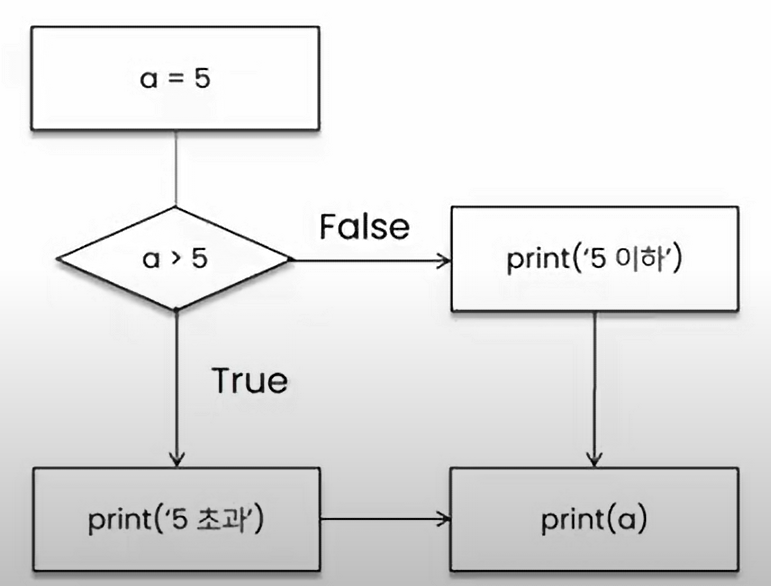
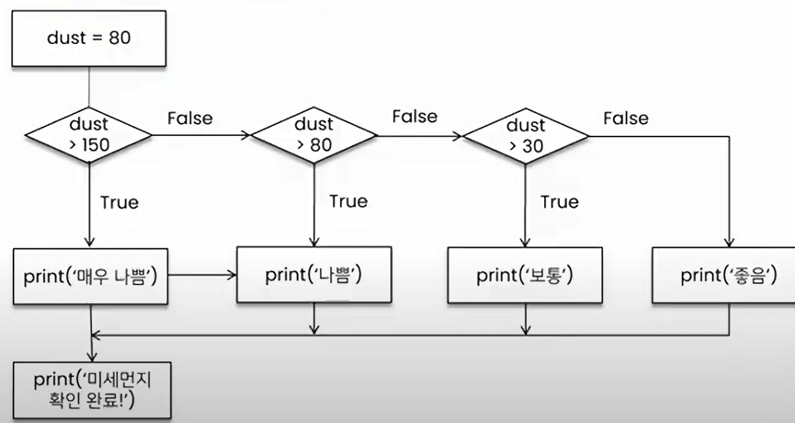
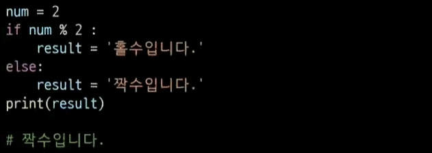
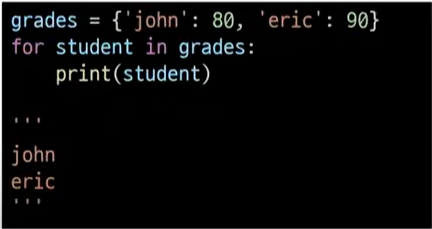
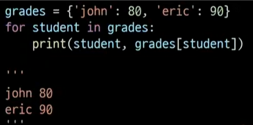
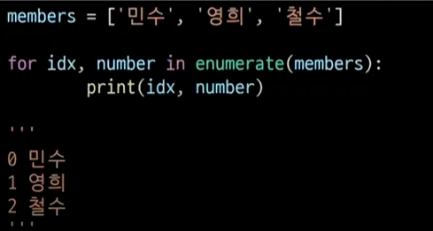
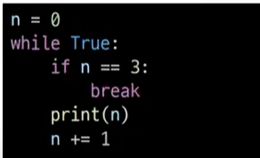
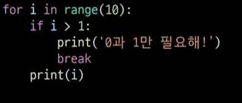
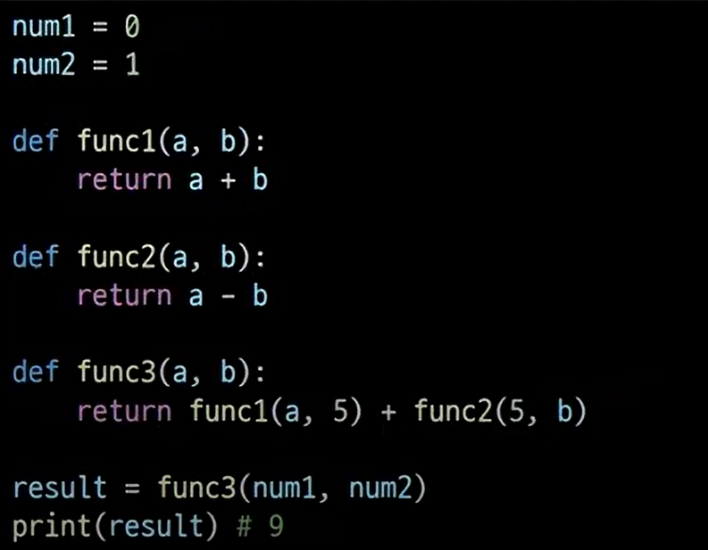
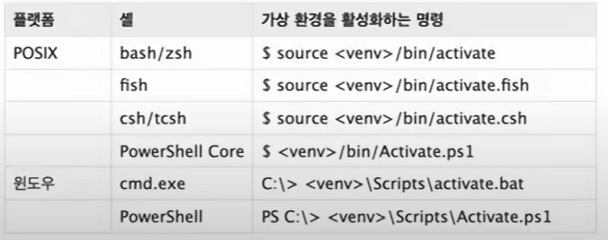

# 제어문

> 제어문(Control Statement)

- 파이썬은 기본적으로 위에서부터 아래로 차례대로 명령을 수행
- 특정 상황에 따라 코드를 선택적으로 실행(분기/조건)하거나 계속하여 실행(반복)하는 제어가 필요함
- 제어문은순서도(flowchart)로 표현이 가능


# 조건문

> 조건문

- 조건문은 참/거짓을 판단할 수 있는 조건식과 함께 사용

> 기본 형식

- 조건에는 참/거짓에 대한 조건식
  - 조건이 참인 경우 이후 들여쓰기 되어있는 코드 블록을 실행
  - 이외의 경우 else 이후 들여쓰기 되어있는 코드 블록을 실행
    - else는 선택적으로 활용할 수 있음
- 들여쓰기 주의 (4 Space, 1 Tab)

> 조건문 예시



```python
a = 6
if a> 5:
    print('5 초과')
else:
    print('5 이하')
print(a)

```


>조건문 실습 문제

- 조건문을 통해 변수 num의 값의 홀수/짝수 여부를 출력하시오.
  - 이때 num은 input을 통해 사용자로부터 입력을 받으시오.

```python
num = int(input('숫자입력'))
if num % 2 == 1:
    print('홀수')
else:
    print('짝수')
```


> 복수 조건문

- 복수의 조건식을 활용할 경우 elif를 활용하여 표현함

```python
if 조건:
    # Code block
elif 조건:
    # Code block
elif 조건:
    # Code block
else:
    # Code block
```


> 복수 조건문 실습 문제

- 미세먼지 농도에 따른 위험 등급이 다음과 같을 때, dust 값에 따라 등급을 출력하는 조건식을 작성하시오.

  (단, 조건식 완료 후 미세먼지 확인 완료라는 문구를 출력)

```python
dust = 80
if dust > 150:
    print('매우 나쁨')
elif dust > 80:
    print('나쁨')
elif dust > 30:
    print('보통')
else:
    print('좋음')
print('미세먼지 확인 완료!')

'''
보통
미세먼지 확인 완료
'''
```


> 복수 조건문 실습 문제 순서도




> 중첩 조건문

- 조건문은 다른 조건문에 중첩되어 사용될 수 있음
  - 들여쓰기에 유의하여 작성할 것

```python
if 조건:
	# Code block
    if 조건:
        # Code block
else:
    # Code block
```


> 중첩 조건문 예시

```python
dust = 500
if dust > 150:
    print('매우 나쁨')
    if dust > 300:
        print('실외 활동을 자제하세요.')
elif dust > 80:
    print('나쁨')
elif dust > 30:
    print('보통')
elif dust >= 0:
    print('좋음')
else:
	print('값이 잘못 되었습니다.')

'''
매우나쁨
실외 활동을 자제하세요.
'''
```


> 조건 표현식

- 조건 표현식(Conditional Expression)이란?
  - 조건 표현식을 일반적으로 조건에 따라 값을 정할 때 활용
  - 삼항 연산자(Ternary operator)로 부르기도 함

```python
#true인 경우 값  (if 조건 else) false인 경우 값
```


> 조건 표현식 실습 문제

- (1)num이 정수일 때, 아래의 코드는 무엇을 위한 코드일까요?

```python
value = num if num >= 0 else -num
```

- 정답: 절댓값을 저장하기 위한 코드


- (2) 다음의 코드와 동일한 조건 표현식을 작성하시오.




```python
num = 2
result = '홀수입니다.' if num % 2 else '짝수입니다.'
print(result)

#짝수입니다.
```


- (3) 다음의 코드와 동일한 조건문을 작성하시오.


```python
num = -5
if num >= 0:
    value = num
else:
    value = 0
print(value) # 0
```


# 반복문

- 특정 조건을 만족할 때까지 같은 동작을 계속 반복하고 싶을 때 사용


> 반복문의 종류

- while문
  - 종료 조건에 해당하는 코드를 통해 반복문을 종료시켜야 함
- for문
  - 반복가능한 객체를 모두 순회하면 종료 (별도의 종료 조건이 필요 없음)
- 반복 제어
  - break, continue, for-else


> while문

- while문은 조건식이 참인 경우 반복적으로 코드를 실행
  - 조건이 참인 경우 들여쓰기 되어 있는 코드 블록이 실행됨
  - 코드 블록이 모두 실행되고, 다시 조건식을 검사하며 반복적으로 실행됨
  - while문은 무한 루프를 하지 않도록 종료 조건이 반드시 필요


> while문 예시

- 아래의 순서도를 while 반복문을 이용해서 코드로 나타내시오.


```python
a = 0
while a < 5:
    print(a)
    a += 1
print('끝')
```


> 복합 연산자(In-Place Operator)

- 복합 연산자는 연산과 할당을 합쳐 놓은 것
  - 예시) 반복문을 통해서 개수를 카운트 하는 경우


> for문

- for문은 시퀀스(String, tuple, list, range)를 포함한 순회 가능한 객체(iterable)의 요소를 모두 순회
  - 처음부터 끝까지 모두 순회하므로 별도의 종료 조건이 필요하지 않음
- Iterable
  - 순회할 수 있는 자료형(String, list, dict, tuple, range, set 등)
  - 순회형 함수(range, enumerate)

```python
for 변수명 in iterable:
    # Code block
```


- 아래의 순서도를 코드로 나타내시오.


```python
for fruit in ['apple', 'mango', 'banana']:
    print(fruit)
print('끝')

'''
apple
mango
banana
'''
```


> for문을 이용한 문자열(String) 순회

- 사용자가 입력한 문자를 한 글자씩 출력하시오. (happy 입력)

```python
chars = input()
# happy
```

```python
for idx in range(len(chars)):
    print(chars[idx])
'''
h
a
p
p
y
'''
```


> 딕셔너리(Dictionary) 순회

- 딕셔너리는 기본적으로 key를 순회하며, key를 통해 값을 활용






> 추가 메서드를 활용한 딕셔너리(Dictionary) 순회

- 추가 메서드를 활용하여 순회할 수 있음
  - keys(): Key로 구성된 결과
  - value(): value로 구성된 결과
  - items(): (Key, value)의 튜플로 구성된 결과


> enumerate 순회

- enumerate()
  - 인덱스와 객체를 쌍으로 담은 열거형(enumerate) 객체 반환
    - (index, value) 형태의 tuple로 구성된 열거 객체를 반환




> List Comprehension

- 표현식과 제어문을 통해 특정한 값을 가진 리스트를 간결하게 생성하는 방법

```python
# [code for 변수 in iterable]

# [code for 변수 in iterable if 조건식]
```


```python
# 1~3의 세제곱 리스트 만들기
cubic_list = []
for number in range(1, 4):
    cubic_list.append(number ** 3)
print(cubic_list)

# [1, 8, 27]
```

```python
cubic_list = [number ** 3 for number in range(1, 4)]

# [1, 8, 27]
```


> Dictionary Comprehension

```python
# {key: value for 변수 in iterable}

# {key: value for 변수 in iterable if 조건식}
```


```python
# 1~3의 세제곱 리스트 만들기
cubic_dict = {}
for number in range(1, 4):
    cubic_dict[number] = number ** 3
print(cubic_dict)

# {1: 1, 2: 8, 3: 27}
```

```python
cubic_dict = {number: number ** 3 for number in range(1, 4)}
print(cubic_dict)

# {1: 1, 2: 8, 3: 27}
```


> 반복문 제어

- break
  - 반복문을 종료
- continue
  - continue 이후의 코드 블록은 수행하지 않고, 다음 반복을 수행
- for - else
  - 끝까지 반복문을 실행한 이후에 else 문 실행
    - break를 통해 중간에 종료되는 경우 else 문은 실행되지 않음
- pass
  - 아무것도 하지 않음(문법적으로 필요하지만, 할 일이 없을 때 사용)


> break

- break문을 만나면 반복문은 종료됨
- 아래 코드의 실행 결과는?



```python
'''
0
1
2
'''
```




```python
'''
0
1
'''
```


> Continue

- continue 이후의 코드 블록은 수행하지 않고, 다음 반복을 수행
- 아래 코드의 실행 결과는?

```python
for i in range(6):
    if i % 2 == 0:
        continue
    print(i)
```


> pass

- 아무것도 하지 않음.
  - 특별히 할 일이 없을 때 자리를 채우는 용도로 사용
  - 반복문 아니어도 사용 가능

```python
# i가 2일때 pass
for i in range(4):
    if i == 2 :
        pass
    print(i)
'''
0
1
2
3
'''
```


> else

- 끝까지 반복문을 실행한 이후에 else문 실행
- else 문은 break로 중단되었는지 여부에 따라 실행

```python
for char in 'apple':
    if char == 'b':
        print('b!')
        break
else:
    print('b가 없습니다.')
# b가 없습니다.
```


```python
for char in 'banana':
    if char == 'b':
        print('b!')
        break
else:
    print('b가 없습니다.')
# b!
```


# 함수

> 함수

- 함수를 왜 사용할까요?

  - Decomposition(분해) : 기능을 분해하고, 재사용 가능하게 만들고

  

  ```python
  numbers = [1, 2, 3]
  
  def average(numbers):
      return sum(numbers) / len(numbers)
  
  print(average(numbers)) # 2.0
  ```

  

  - Abstraction(추상화)
    - 사실 내부 구조를 변경할 게 아니라면 몰라도 무방
      - 그것이 함수의 장점이자 프로그래밍의 매력
      - 스마트폰의 원리를 잘 몰라도 우리는 잘 사용할 수 있음


> 함수의 종류

- 함수는 크게 3가지로 분류
  - 내장 함수 (파이썬 개발자가 만듦)
    - 파이썬에 기본적으로 포함된 함수
  - 외장 함수 (다른 개발자가 만듦)
    - import 문을 통해 사용하며, 외부 라이브러리에서 제공하는 함수
  - 사용자 정의 함수 (내가 만듦)
    - 직접 사용자가 만드는 함수


> 함수의 정의

- 함수 (Function)

  - 특정한 기능을 하는 코드의 조각(묶음)

  - 특정 코드를 매번 다시 작성하지 않고,

    필요시에만 호출하여 간편히 사용

    

> 함수의 기본 구조

- 선언과 호출(define & call)
- 입력(Input)
- 문서화(Docstring)
- 범위(Scope)
- 결과값(Output)


> 선언과 호출(define & call)

- 함수의 선언은 def 키워드를 활용함
- 들여쓰기를 통해 Function body(실행될 코드 블록)를 작성함
  - Docstring은 함수 body 앞에 선택적으로 작성 가능
    - 작성 시에는 반드시 첫 번째 문장에 문자열 ''''''
- 함수는 parameter를 넘겨줄 수 있음
- 함수는 동작 후에 return을 통해 결괏값을 전달함


> 함수의 정의

- 함수를 사용하기 위해서는 먼저 함수를 정의해야 함

```python
def function_name(parameter):
    # Code block
    return returning_value
```


> 선언과 호출(define & call)

- 함수는 함수명() 으로 호출하여 사용
  - parameter가 있는 경우, 함수명(값1, 값2, ...)로 호출

```python
def foo():
    return True

def add(x, y):
    return x + y
```


> 함수 실행 순서 예시

- 이 코드의 실행 결과는 왜 9일까요?




> 값에 따른 함수의 종류

- Void function
  - 명시적인 return 값이 없는 경우, None을 반환하고 종료
- Value returning function
  - 함수 실행 후, return문을 통해 값 반환
  - return을 하게 되면, 값 반환 후 함수가 바로 종료
- print는 값을 출력하지만, 값을 반환하진 않습니다.

> 주의

- print 함수와 return의 차이점

  - print를 사용하면 호출될 때마다 값이 출력됨(주로 테스트를 위해 사용)

  - 데이터 처리를 위해서는 return 사용

- REPL(Read-Eval-Print Loop) 환경에서는 마지막으로 작성된 코드의 리턴 값을 보여주므로 같은 동작을 하는 것으로 착각할 수 있음(jupyter notebook)


> 튜플을 활용하여 두 개 이상의 값 반환

- 반환 값으로 튜플 사용

```python
def minus_and_product(x, y):
    return x - y, x * y

y = minus_and_product(4, 5)
print(y) # (-1, 20)
print(type(y)) # <class 'tuple'>
```


> 함수 반환 정리

- return X -> None
- return O -> 하나를 반환


> Parameter와 Argument

- Parameter : 함수를 정의할 때, 함수 내부에서 사용되는 변수
- Argument : 함수를 호출 할 때, 넣어주는 값

```python
def function(ham): # parameter : ham
    return ham

function('spam') # argument : spam
#함수 리턴 값 : spam
```


> Argument

- Argument란 ?
  - 함수 호출 시 함수의 parameter를 통해 전달되는 값
  - Argument는 소괄호 안에 할당 func_name(argument)
    - 필수 Argument: 반드시 전달되어야 하는 argument
    - 선택 Argument: 값을 전달하지 않아도 되는 경우는 기본값이 전달

>Positional Arguments

- 기본적으로 함수 호출 시 Argument는 위치에 따라 함수 내에 전달됨

```python
def add(x, y):
    return x + y

add(2, 3) # x = 2, y = 3
```


> Keyword Arguments

- 직접 변수의 이름으로 특정 Argument를 전달할 수 있음
- Keyword Argument 다음에 Positional Argument를 활용할 수 없음

```python
def add(x, y):
    return x + y

add(x = 2, y = 5)
add(2, y = 5)
#add(x = 2, 5) 에러 발생 
```


> Default Arguments Values

- 기본값을 지정하여 함수 호출 시 argument 값을 설정하지 않도록 함
  - 정의된 것 보다 더 적은 개수의 argument 들로 호출될 수 있음

> 정해지지 않은 여러 개의 Arguments 처리

print 함수의 Arguments 개수가 변해도 잘 동작하는 이유는 ?

```python
print('hello')
# hello

print('you', 'need', 'python')
#you need python

```

- 애스터리스크(Asterisk) 혹은 언패킹 연산자라고 불리는 * 덕분


> 가변인자(*args)

- 가변인자란?
  - 여러 개의 Positional Argument를 하나의 필수 parameter로 받아서 사용
- 가변인자는 언제 사용하는가?
  - 몇 개의 Positional Argument를 받을지 모르는 함수를 정의할 때 유용

```python
def add(*args):
    for arg in args:
        print(arg)
        
add(2)
add(2, 3, 4, 5)
```


> 패킹 / 언패킹

- 가변 인자를 이해하기 위해서는 패킹, 언패킹을 이해해야 함
- 패킹
  - 여러 개의 데이터를 묶어서 변수에 할당하는 것

```python
numbers = (1, 2, 3, 4, 5) # 패킹
print(numbers) # (1, 2, 3, 4, 5)
```

- 언패킹
  - 시퀀스 속의 요소들을 여러 개의 변수에 나누어 할당하는 것

```python
numbers = (1, 2, 3, 4, 5)
a, b, c, d, e = numbers # 언패킹
print(a, b, c, d, e) # 1 2 3 4 5
```


- 언패킹시 변수의 개수와 할당하고자 하는 요소의 갯수가 동일해야함

```python
numbers = (1, 2, 3, 4, 5) # 패킹
a, b, c, d, e, f = numbers # 언패킹
# ValueError: not enough values to unpack (expected 6, got 5)
```

- 언패킹시 왼쪽의 변수에 asterisk(*)를 붙이면, 할당하고 남은 요소를 리스트에 담을 수 있음

```python
numbers = (1, 2, 3, 4, 5, 6) # 패킹

a, b, *rest = numbers # 1, 2를 제외한 나머지를 rest에 대입
print(a, b, rest) # 1 2 [3, 4 ,5, 6]

a, *rest, e = numbers # 1, 6을 제외한 나머지를 rest에 대입
print(rest) # [2, 3, 4, 5]
```


> Asterisk(*)와 가변 인자

- *는 시퀸스 언패킹 연사자라고도 불리며, 말 그래도 시퀀스를 풀어 헤치는 연산자
  - 주로 튜플이나 리스트를 언패킹하는데 사용
  - *를 활용하여 가변 인자를 만들 수 있음

```python
def func(*args):
    print(args)
    print(type(args))
    
func(1, 2, 3, 'a', 'b')
'''
(1, 2, 3, 'a', 'b')
<class 'tuple'>
'''
```


> 가변 인자 예시

- packing을 통해 받은 모든 숫자들의 합을 구하는 함수 만들기

```python
def sum_all(*numbers):
    result = 0
    for number in numbers:
        result += number
    return result

print(sum_all(1, 2, 3)) # 6
print(sum_all(1, 2, 3, 4, 5, 6)) # 21
```


- 반드시 받아야 하는 인자와, 추가적인 인자를 구분해서 사용할 수 있음

```python
def print_family_name(father, mother, *pets):
    print(f'아버지 : {father}')
    print(f'어머니 : {mother}')
    print('반려동물들..')
    for name in pets:
        print(f'반려동물: {name}')
        
print_family_name('아부지', '어무니', '멍멍이', '냥냥이')

'''
아버지 : 아부지
어머니 : 어무니
반려동물들..
반려동물: 멍멍이
반려동물: 냥냥이
'''
    
```


> 가변 키워드 인자(**kwargs)

- 몇 개의 키워드 인자를 받을지 모르는 함수를 정의할 때 유용
- ******kwargs는 딕셔너리로 묶여 처리되며, parameter에 ******를 붙여 표현

```python
def family(**kwargs):
    for key, value in kwargs.items():
        print(key, ":", value)
family(father='아부지', mother='어무니', baby= '아기')
'''
father : 아부지
mother : 어무니
baby   : 아기
'''
```


> 가변 키워드 인자(******kwargs) 예시

```python
def print_family_name(father, mother, **pets):
    print(f'아버지 : {father}')
    print(f'어머니 : {mother}')
    if pets:
    	print('반려동물들..')
        for species, name in pets.items():
            print(f'{species} : {name}')
        
print_family_name('아부지', '어무니', dog='멍멍이', cat='냥냥이')

'''
아버지 : 아부지
어머니 : 어무니
반려동물들..
dog: 멍멍이
cat: 냥냥이
'''
    
```


> 가변 인자(*args) 와 가변 키워드 인자(******kwargs) 동시 사용 예시

- 가변 인자와 가변 키워드 인자를 함께 사용할 수 있음

```python
def print_family_name(*parents, **pets):
    print("아버지 :", parents[0])
    print("어머니 :", parents[1])
    if pets:
        print("반려동물들..")
        for title, name in pets.items():
            print('{} : {}'.format(title, name))
         
print_family_name('아부지', '어무이', dog='멍멍이', cat='냥냥이')

'''
아버지 : 아부지
어머니 : 어무이
반려동물들
dog : 멍멍이
cat : 냥냥이
'''
```


# Python의 범위 (Scope)

> Python의 범위(Scope)

- 함수는 코드 내부에 local scope를 생성하며,

  그 외의 공간인 global scope로 구분

- scope

  - global scope : 코드 어디에서든 참조할 수 있는 공간
  - local scope: 함수가 만든 scope. 함수 내부에서만 참조 가능

- variable

  - global variable : global scope에 정의된 변수
  - local variable : local scope에 정의된 변수


> 변수 수명주기(lifecycle)

- 변수는 각자의 수명주기(lifecycle)가 존재
  - built-in scope
    - 파이썬이 실행된 이후부터 영원히 유지
  - global scope
    - 모듈이 호출된 시점 이후 혹은 인터프리터가 끝날 때까지 유지
  - local scope
    - 함수가 호출될 때 생성되고, 함수가 종료될 때까지 유지

> 예시

```python
def func():
    a = 20
    print('local', a) # local 20

func()
print('global', a) # NameError: name 'a' is not defined
```


> 이름 검색 규칙 (Name Resolution)

- 파이썬에서 사용되는 이름(식별자)들은 이름공간(namespace)에 저장되어 있음
- 아래와 같은 순서로 이름을 찾아나가며, LEGB Rule이라고 부름
  - Local scope : 지역 범위(현재 작업 중인 범위)
  - Enclose scope: 지역 범위 한 단계 위 범위
  - Global scope: 최상단에 위치한 범위
  - Built-in scope:모든 것을 담고 있는 범위(정의하지 않고 사용할 수 있는 모든 것)
    - ex) print()
- 함수 내에서는 바깥 Scope의 변수에 접근 가능하나 수정은 할 수 없음


> LEGB 예시 1

```python
print(sum) # <built-in function sum>
print(sum(range(2))) # 1
sum = 5
print(sum) # 5
print(sum(range(2))) # TypeError: 'int' object is not callable
```


> LEGB 예시 2

```python
a = 0
b = 1
def enclose():
    a = 10
    c = 3
    def local (c):
        print(a, b, c) # 10 1 300
    local(300)
    print(a, b, c) # 10 1 3
enclosed()
print(a, b) # 0 1
```


> global 문

- 현재 코드 블록 전체에 적용되며, 나열된 식별자(이름)이 global variable임을 나타냄
  - global에 나열된 이름은 같은 코드 블록에서 global 앞에 등장할 수 없음
  - global에 나열된 이름은 parameter, for 루프 대상, 클래스/함수 정의 등으로 정의되지 않아야 함

> global 예시

```python
# 함수 내부에서 글로벌 변수 변경하기
a = 10
def func1():
    global a
    a = 3
    
print(a) # 10
func1()
print(a) # 3
```

- Local space에서 global 변수 값의 변경

  global 키워드를 사용하지 않으면, Local scope에 a 변수가 생성


> global 관련 에러

```python
# global 주의 사항
a = 10
def func1():
    print(a) # global a 선언 전에 사용
    global a
    a = 3

print(3)
func1()
print(a)

# SyntaxError: name 'a' is used prior to global declaration
```

```python
# global 주의 사항
a = 10
def func1(a):
    global a # parameter에 global 사용 불가
    a = 3
 
print(a)
func1(3)
print(a)

# SyntaxError: name 'a' is parameter and global
```


> nonlocal

- global을 제외하고 가장 가까운 (둘러싸고 있는) scope의 변수를 연결하도록 함
  - nonlocal에 나열된 이름은 같은 코드 블록에서 nonlocal 앞에 등장할 수 없음
  - nonlocal에 나열된 이름은 parameter, for 루프 대상, 클래스/함수 정의 등으로 정의되지 않아야함
- global과는 달리 이미 존재하는이름과의 연결만 가능함


> nonlocal 예시

```python
# nonlocal 예시
x = 0
def func1():
    x = 1
    def func2():
        nonlocal x
        x = 2
    func2()
    print(x) # 2
    
func1()
print(x) # 0
```


> nonlocal, global 비교

```python
# 선언된 적 없는 변수의 활용
def func1():
    global out
    out = 3
    
func1()
print(out) # 3
```

```python
# 선언된 적 없는 변수의 활용
def func1():
    def func2():
        nonlocal y
        y = 2
    func2()
    print(y)
    
func1()

# SyntaxError: no binding for nonlocal 'y' found
```


> 함수의 범위 주의

- 기본적으로 함수에서 선언된 변수는 Local scope에 생성되며, 함수 종료시 사라짐
- 해당 scope에 변수가 없는 경우 LEGB rule에 의해 이름을 검색함
  - 변수에 접근은 가능하지만, 해당 변수를 수정할 수는 없음
  - 값을 할당하는 경우 해당 scope의 이름공간에 새롭게 생성되기 때문
  - 단, 함수 내에서 필요한 상위 scope 변수는 argument로 넘겨서 활용할 것
- 상위 scope에 있는 변수를 수정하고 싶다면 global, nonlocal 키워드를 활용 가능
  - 단, 코드가 복잡해지면서 변수의 변경을 추적하기 어렵고, 예기치 못한 오류가 발생
  - 가급적 사용하지 않는 것을 권장하며, 함수로 값을 바꾸고자 한다면 항상 argument 리턴값을 사용하는 것을 추천


# 함수 응용

> 내장 함수(Built-in Functions)

- 파이썬 인터프리터에는 항상 사용할 수 있는 많은 함수와 형(type)이 내장되어 있음


> map

- map(function, iterable)

- 순회 가능한 데이터구조(iterable)의 모든 요소에 함수(function) 적용하고, 그 결과를 map object로 반환

```python
numbers = [1, 2, 3]
result = map(str, numbers)
print(result, type(result)) # <map object at 0x0000020984097FA0> <class 'map'>
print(list(reuslt)) # ['1', '2', '3']
```


> map 활용 사례

- 알고리즘 문제 풀이시 input 값들을 숫자로 바로 활용하고 싶을 때

```python
n, m = map(int, input().split()) # 3, 5를 입력하면
print(n, m) # 3, 5
print(type(n), type(m)) # <class 'int'> <class 'int'>
```


> filter

- filter(function, iterable)
- 순회 가능한 데이터구조(iterable)의 모든 요소에 함수(function)적용하고, 그 결과가 True인 것들을 filter object로 반환

```python
def odd(n):
    return n % 2:
number = [1, 2, 3]
result = filter(odd, numbers)
print(result, type(result)) #filter object at 0x000001FB4B217F40> <class 'filter'>
print(list(result)) # [1, 3]
```


> zip

- zip(*iterables)
- 복수의 iterable을 모아 튜플을 원소로 하는 zip object를 반환

```python
girs = ['jane', 'ashley']
boys = ['justin', 'eric']
pair = zip(girls, boys)
print(pair, type(pair)) # <zip object at 0x000001A4B3DD0380> <class 'zip'>
print(list(pair)) # [('jane','justin'),('ashley','eric')]
```


> lambda 함수

- 람다함수 labmbda[parameter]: 표현식
  - 표현식을 계산한 결과값을 반환하는 함수로, 이름이 없는 함수여서 익명함수라고도 불림
- 특징
  - return문을 가질 수 없음
  - 간편 조건문 외 조건문이나 반복문을 가질 수 없음
- 장점
  - 함수를 정의해서 사용하는 것보다 간결하게 사용 가능
  - def를 사용할 수 없는 곳에서도 사용가능


```python
# 삼각형의 넓이를 구하는 공식 -def
def triangle_area(b, h):
    return 0.5 * b * h
print(triangle_area(5,6)) # 15.0

# 삼각형의 넓이를 구하는 공식 - 람다
triangle_area = lambda b, h : 0.5 * b * h
print(triangle_area(5, 6)) # 15.0
```


> 재귀 함수(recursive function)

- 자기 자신을 호출하는 함수
- 무한한 호출을 목표로 하는 것이 아니며, 알고리즘 설계 및 구현에서 유용하게 활용
  - 알고리즘 중 재귀 함수로 로직을 표현하기 쉬운 경우가 있음(예 - 점화식)
  - 변수의 사용이 줄어들며, 코드의 가독성이 높아짐
- 1개 이상의 base case(종료되는 상황)가 존재하고, 수렴하도록 작성


> 예시

- Factorial

```python
def factorial(n):
    if n == 0 or n == 1 :
        return 1
    else:
        return n * factorial(n-1)
print(factorial(4)) # 24
```


> 재귀 함수 주의 사항

- 재귀 함수는 base case에 도달할 때까지 함수를 호출함
- 메모리 스택이 넘치게 되면 (stack overflow) 프로그램이 동작하지 않게 됨
- 파이썬에서는 최대 재귀 깊이(maximum recursion depth)가 1,000번으로, 호출 횟수가 이를 넘어가게 되면 Recursion Error 발생


> 재귀 함수를 반복문으로 표현

``` python
def fact(n):
    result = 1
    while n > 1:
        result *= n
        n -= 1
    return result
print(fact(4)) # 24
```


> 반복문과 재귀 함수 비교

- 알고리즘 자체가 재귀적인 표현이 자연스러운 경우 재귀함수를 사용함.
- 재귀 호출은 변수 사용을 줄여줄 수 있음.
- 재귀 호출은 입력 값이 커질 수록 연산 속도가 오래 걸림.


# 모듈

> 모듈과 패키지

- 모듈(module) : 다양한 기능을 하나의 파일로
  - 특정 기능을 하는 코드를 파이썬 파일(.py) 단위로 작성한 거
- 패키지(package): 다양한 파일을 하나의 폴더로
  - 특정 기능과 관련된 여러 모듈의 집합
  - 패키지 안에는 또 다른 서브 패키지를 포함
- 라이브러리(library): 다양한 패키지를 하나의 묶음으로

( 라이브러리는 삽... 프레임워크는 포크레인... 차이는 주도권!)

- pip : 라이브러리 관리자

- 가상환경 : 패키지의 활용 공간


> 모듈과 패키지 불러오기

- import module
- from module import var, function, Class
- from module import *


- from package import module
- from package.module import var, function, Class


> 파이썬에 기본적으로 설치된 모듈과 내장 함수

- 파이썬에 기본적으로 설치된 모듈과 내장 함수
  - 예시 - random.py


> 파이썬 패키지 관리자(pip)

- PyPI(Python Package Index)에 저장된 외부 패키지들을 설치하도록 도와주는 패키지 관리 시스템


- 패키지 설치
  - 최신 버전 / 특정 버전 / 최소 버전을 명시하여 설치할 수 있음
  - 이미 설치되어 있는 경우 이미 설치되어 있음을 알리고 아무것도 하지 않음
    - $ pip install SomePackage
    - $ pip install SomePackage==1.0.5
    - $ pip install 'SomePackage>=1.0.4'
  - 모두 bash, cmd 환경에서 사용되는 명령어


- 패키지 삭제

  - pip는 패키지 업그레이드를 하는 경우 과거 버전을 자동으로 지워줌
  - $ pip uninstall SomePacakage

  

- 패키지 목록 및 특정 패키지 정보

  -  $ pip list

  -  $ pip show SomePackage

- 패키지 관리하기 (다양한 파이썬 프로젝트에서 사용됨)
  - 아래의 명령어들을 통해 패키지 목록을 관리[1]하고 설치할 수 있음[2]
  - 일반적으로 패키지를 기록하는 파일의 이름은 requirements.txt로 정의함
    -  $ pip freeze > requirements.txt
    -  $ pip install -r requirements.txt


# 사용자 모듈과 패키지

> 패키지

- 패키지는 여러 모듈/하위 패키지로 구조화
  - 활용 예시 : package.module
- 모든 폴더에는 ______init______.py를 만들어 패키지로 인식
  - Python 3.3부터는 파일이 없어도 되지만, 하위 버전 호환 및 프레임워크 등에서의 동작을 위해 파일을 생성하는 것을 권장


> 패키지 만들기

- 계산 기능이 들어간 calculator 패키지를 아래와 같이 구성
  - check.py에서 calculator의 tools.py의 기능을 사용
- 폴더 구조
  - my_package/
  - ______init______.py
  - check.py
  - calculator/
    - ______init______.py
    - tools.py


# 가상환경

- 파이썬 표준 라이브러리가 아닌 외부 패키지와 모듈을 사용하는 경우 모두 pip를 통해 설치를 해야함
- 복수의 프로젝트를 하는 경우 버전이 상이할 수 있음
  - 과거 외주 프로젝트 -django 버전 2.x
  - 신규 회사 프로젝트 - django 버전 3.x
- 이러한 경우 가상환경을 만들어 프로젝트별로 독립적인 패키지를 관리할 수 있음


- 가상 환경을 만들고 관리하는데 사용되는 모듈(Python 버전 3.5부터)
- 특정 디렉토리에 가상 환경을 만들고, 고유한 파이썬 패키지 집합을 가질 수 있음
  - 특정 폴더에 가상 환경이(패키지 집합 폴더 등) 있고
  - 실행 환경 (예- bash)에서 가상환경을 활성화 시켜
  - 해당 폴더에 있는 패키지를 관리/사용함

```bash
$ python -m venv(virtual environment) venv (가상환경 이름을 venv로 하겠다.)
$ pip list
$ source venv/Scripts/activate
(venv)

$ pip list

$ pip install requests
```


>  가상환경 활성화/비활성화

- 아래의 명령어를 통해 가상환경을 활성화
  - <venv> 는 가상환경을 포함하는 디렉토리의 경로



- 가상환경 비활성화는 $ deactivate 명령어를 사용

- cmd 와 bash 환경
  - $ source venv/Scripts/activate
- 동일 컴퓨터에서 별도의 가상환경