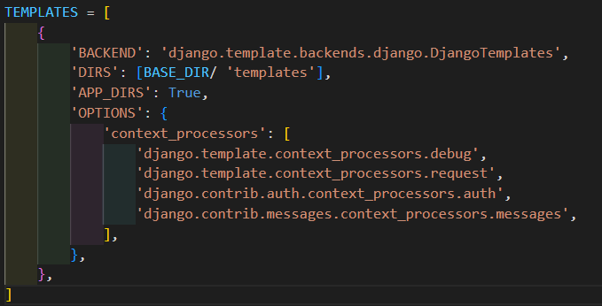
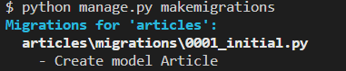
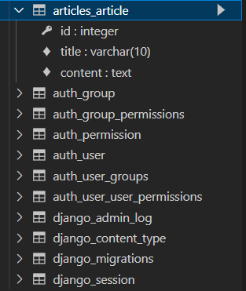

# 가상환경 설정


1. bash 이용

```bash
$ python -m venv venv
$ source venv/Scripts/activate
#$ pip list
1.
	$ pip install -r requirements.txt
2.
	$ pip install django==3.2.13
	$ pip freeze > requirements.txt # pip list 저장
```


2. vscode 이용

vscode에서 `ctrl+shift+p`  + `python select interpreter` + `venv` 클릭


---


# NameSpace

## `URL namespace`

```django
 ->  
```


project단에서 각 app의 urls에 접근할 수 있도록 path, include 메서드를 활용하여 설정해줍니다.


articles/urls.py 에서 app_name을 등록해줍니다.


pages/urls.py 에서도 app_name을 등록해줍니다.




여기서 `app_name`은 속성값 입니다. pjt/settings.py 에서 TEMPLATES 리스트 내부에 있는 딕셔너리 키 값 중 'APP_DIRS'가 True로 되어 있기 때문에 자동으로 속성이 동작합니다.


위와 같이 `{% url 'app_name:name'` 입력해주면 namespace를 활용할 수 있습니다.


## `Template namespace`

```python
def index(request):
    return render(request, 'index.html')

↓↓↓↓↓↓↓↓↓↓↓↓↓↓

def index(request):
    return render(request,'articles/index.html')
```


장고는 기본적으로 `articles/templates/` + `path` 형식을 갖추고 있습니다.

또한 장고는 path명을 앱이 등록된 순서대로 찾기 때문에 pages에도 같은 이름의 path명이 있다면 영원히 찾을 수 없게 됩니다.

`articles/templates/` + `path` <<

`pages/templates` + `path` 


그렇다면 물리적으로 namespace를 나눠주는 방법을 사용해야합니다.

`articles/templates/` + `articles/path`

`pages/templates` + `pages/path`


- articles/templates 하위에 articles 폴더를 생성하고, articles폴더에 html파일들을 넣어줍니다.


이후 `views.py`에서 render 함수의 두번째 인자를 `path` -> `articles/path` 처럼 바꿔주면 됩니다.


---


# Database

- 체계화된 데이터의 모임


## Database의 기본 구조

1. 스키마(Schema)

   - 뼈대(Structure)

   - 데이터베이스에서 자료의 구조, 표현 방법, 관계 등을 정의한 구조

     

2. 테이블(Table)

   - 필드와 레코드를 사용해 조직된 데이터 요소들의 집합
   - 관계(Relation)라고도 부름

   1. 필드
      - 속성, 컬럼(Column)
   2. 레코드
      - 튜플, 행(Row)


3. PK (Primary Key)
   - 기본 키
   - 각 레코드의 고유한 값
   - 기술적으로 다른 항목과 절대로 중복될 수 없는 단일 값(unique)
   - 데이터베이스 관리 및 테이블 간 관계 설정 시 주요하게 활용 됨


4. 쿼리(Query)
   - 데이터를 조회하기 위한 명령어
   - 조건에 맞는 데이터를 추출하거나 조작하는 명령어


---


# Model

- 모델을 통해 DB에 접근하여 데이터를 관리합니다.
- 웹 애플리케이션의 데이터를 구조화하고 조작하기 위한 도구 입니다.


# Migrations

-Django가 모델에 생긴 변화를 실제 DB에 전달합니다.


> Migrations 관련 주요 명령어 (필수)

1. makemigrations : 모델의 변경사항에 대한 새로운 migration을 만들 때 사용

   `$ python manage.py makemigrations`

   

   

   migration == 설계도 == 청사진 : `아직 DB에 테이블이 생기지는 않았다.`

   

2. migrate : makemigrations로 만든 설계도를 실제 DB에 반영하는 과정 (db.sqlite3 파일에 반영) --> `동기화`

   `$ python manage.py migrate`


0001, 0002 ... 숫자 네자리가 붙어있으면 migration 파일입니다.

그런데 우리가 만든 설계도는 `0001_initail.py` 하나 뿐인데 수많은 migration파일들이 존재하는 것 같이 보입니다. 이는 기존에 존재하는 django 내부적으로 존재하는 내장 app들에 각각 설계도들이 존재하고 처음 migrate를 할 때 내장 app에도 설계도를 만들어주기 때문에 위와같이 수많은 파일들이 생성되는 것 처럼 보이는 것입니다.


# sqlite


> 확장프로그램 설치

vscode에서 sqlite 설치


Open Database 클릭


아래쪽에 db.sqlite3 클릭




`app _ class` 형식으로 테이블이 생성됩니다.


## [참고] Migration 기타 명령어

`python manage.py showmigrations articles 0001`

`sqlmigrate`


## 추가 필드 정의


추가필드 작성


`python manage.py makemigrations`

설계도 작성


이미 존재하는 테이블에 새로운 컬럼이 추가되는 요구사항을 받았는데, 이러한 컬럼들은 기본적으로 빈 값을 갖고 추가될 수 없음

1) 다음 화면으로 넘어가서 새 컬럼의 기본 값을 직접 입력하는 방법

2) 현재 과정에서 나가고 모델 필드에 default 속성을 직접 작성하는 방법


> 1번을 선택한 경우


DateTimeField의 경우 장고에서 python 모듈 timezone.now를 추천해주는데, enter를 입력하면 자동으로 적용해줌. 


0002_auto_20220831_1349.py 파일이 생성 됨


0001_initial.py 를 dependencies에 추가하여 추가로 변경된 내용들만 아래에 작성 됨


`python manage.py migrate`


> 결과


---

> DateTimeField()

- 날짜 및 시간을 값으로 사용하는 필드
- 선택 인자
  1. auto_now_add
     - 최초 생성 일자
     - 데이터가 실제로 만들어질 때 현재 날짜와 시간으로 자동으로 초기화 되도록 함
  2. auto_now
     - 최종 수정 일자
     - 데이터가 수정될 때마다 현재 날짜와 시간으로 자동으로 갱신되도록 함


---


# ORM

- Object-Relational-Mapping
- 객체 지향 프로그래밍 언어를 사용하여 호환되지 않는 유형 시스템 간에 데이터를 변환하는 프로그래밍 기술 (Django <-> DB)
- Django는 내장 Django ORM을 사용함.
- SQL을 사용하지 않고 데이터베이스를 조작할 수 있게 만들어주는 매개체


- 장점
  - SQL을 잘 알지 못해도 객체지향 언어로 DB조작이 가능
  - 객체 지향적 접근으로 인한 높은 생산성
- 단점
  - ORM 만으로 세밀한 데이터베이스 조작을 구현하기 어려운 경우가 있다.


- ORM은 생산성을 위해 사용합니다. 현시대 개발에서 가장 중요한 키워드는 바로 생산성!!


---

# QuerySet API

- ORM이 사용하는 메서드들이 포함되어있습니다.
- 실습 편의를 위한 추가 라이브러리 설치 및 설정

` pip install ipython` : 파이썬 기본 쉘보다 더 강력한 파이썬 쉘

`pip install django-extentions`: Django 확장 프로그램 모음. shell_plus 등 다양한 확장 기능 제공

`pip freeze > requirements.txt`


명령어를 통해 설치 진행


pjt/settings.py 에서 외부라이브러리를 등록해줍니다.


`python manage.py shell_plus`


필요한 기능들을 자동으로 import 해주기 때문에 shell 대신 shell_plus를 사용한다.


Article.		objects.		all()

= `Model class`. `Manager`. `Queryset API`

Article 클래스의 전체 데이터를 DB로 부터 조회를 요청합니다.

데이터가 비어있기 때문에 QuerySet 타입으로 [] 빈 리스트가 출력됩니다.

- 단, 데이터베이스가 단일한 내용을 반환할 때는 QuerySet 타입이 아닌 인스턴스 형태로 반환합니다.


---

# CRUD

## Create

> 데이터 객체를 만드는 3가지 방법

- 첫번째 방법
  1. article = Article()
  2. article.title
     - 클래스 변수명과 같은 이름의 인스턴스 변수를 생성 후 값 할당
  3. article.save()
     - 인스턴스로 save 메서드 호출


article.save()를 호출해야만 `django -> DB`로 저장됩니다.

Article object (1) 에서 1은 id의 갯수를 의미합니다.


- 두번째 방법
  1. 인스턴스 생성 시 초기 값을 함께 작성하여 생성


전체 조회


위와 같이 최근 값을 조회할 수 있습니다.


- 세번째 방법

  `Article.objects.create(title='third', content='django!')`


create 메서드는 save(), 출력 기능을 모두 포함합니다.


## Read

`QuerySet 조회 all()`


`단일 데이터 조회 get()`

- unique한 값을 조회할 때 사용 (pk조회)
- 객체를 찾을 수 없으면 DoesNotExist,  둘 이상의 객체를 찾으면 MultipleReturned 예외 발생


예외


`filter()`


조회 결과가 있던 없던 QuerySet이 반환 됨


'ja'가 포함된 레코드들을 반환


---

## Update


## Delete


---

[참고] ______str______()


models.py 에서 def ______str______을 정의해줍니다

def 부분은 DB에 영향을 미치지 않기 때문에 `python manage.py makemigrations` 해줄 필

** 반드시 shell_plus를 껐다가 다시 실행해야 적용됩니다. **

`exit()`

`python manage.py shell_plus`

