django


# 가상환경 활성화


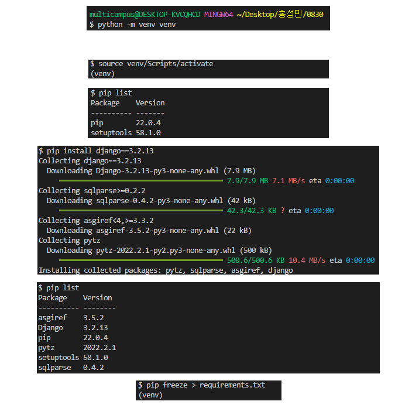

# 프로젝트 생성

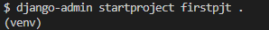

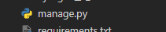


# 프로젝트 실행

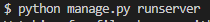

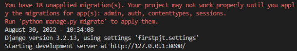

빨간색 글씨 (You have 18 unapplied ... )는 DB때문에 발생한 것입니다.

http://127.0.0.1:8000 ctrl + click

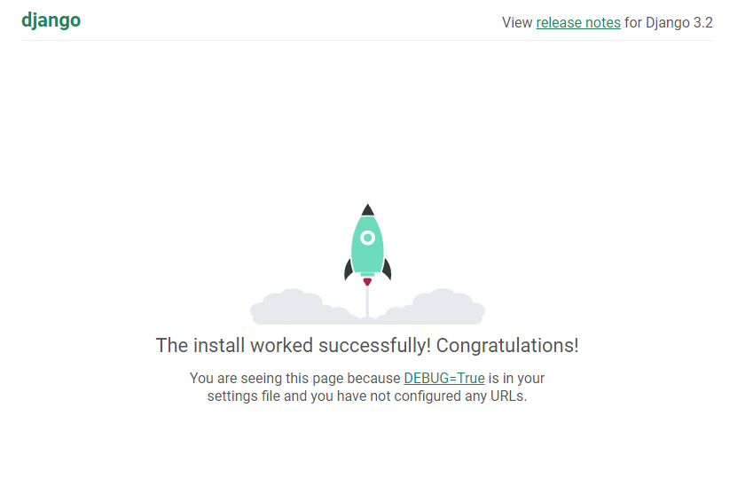

^^ 로그가 뜨는 서버

빠져나오려면 git bash창에서 ctrl + c


# 애플리케이션 생성

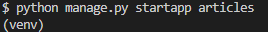

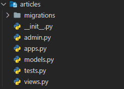


**프로젝트에서 앱을 사용하기 위해서는 반드시 애플리케이션을 등록해야합니다. **

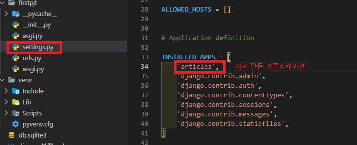

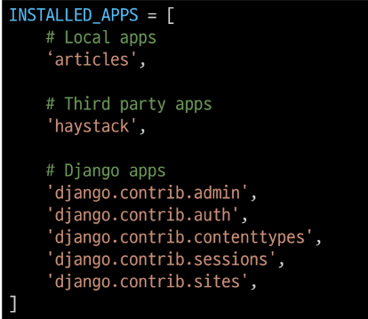

​											advanced 프로젝트 진행할 때를 대비해서 위와같이 나눠주면 좋습니다.

# url 설정

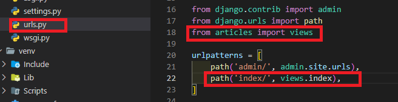


# view 설정

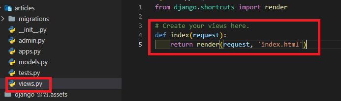


# templates 디렉토리 생성

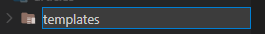

articles 하위에 만들어 줍니다.

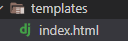

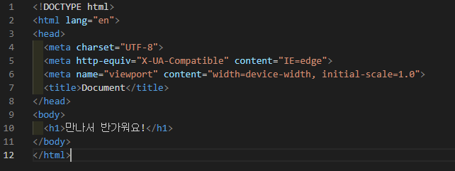

^^ index.html


# 오류 발생

VScode를 껐다가 켜면 다시 한 번 source venv/Scripts/activate (가상환경 활성화)를 해줘야 합니다.

```
couldn't import Django. Are you sure it's installed and available on your PYTHONPATH environment variable? ...
```


# 한국어 설정

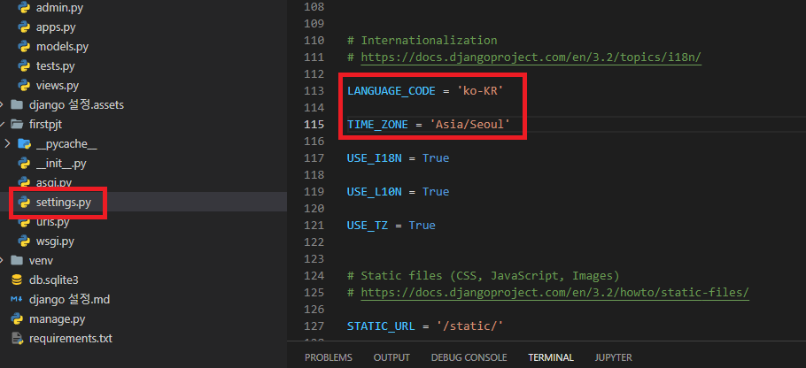


# DTL (Django Template Language)

- 조건, 반복, 변수 치환, 필터 등의 기능을 제공
  - 파이썬 코드로 실행되는 것이 아님(표기법이 다름)
- HTML 안에 쓰는 것임을 명심


> variable :  밑줄(_)로 시작할 수 없음. 공백이나 구두점 문자 사용x, dot(.)을 이용하여 변수 속성에 접근할 수 있음. render()의 세번째 인자로 ...
>
> {{variable}}


> Filter : 표시할 변수를 수정할 때 사용
>
> {{variable|filter}}
>
> {{name|lower}}
>
> {{name|trunctatewords:30}}


> Tag
>
> 
>
> 


> Comments
>
> {# #}
>
> ctrl + /


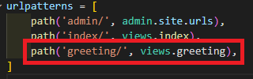


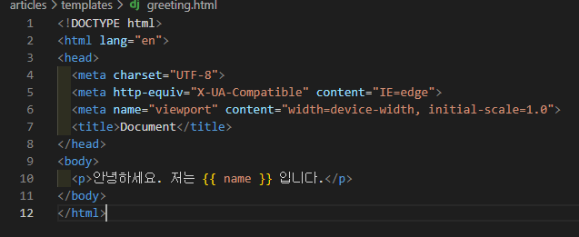

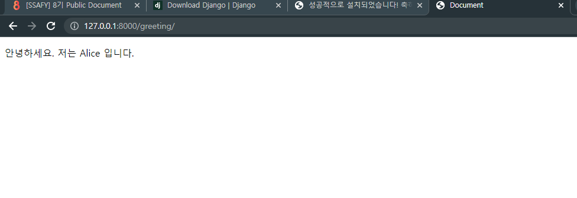

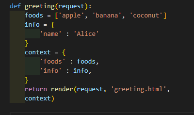

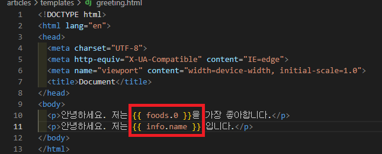

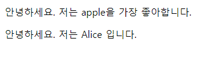


> 랜덤으로 받아오기

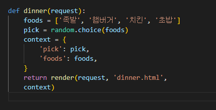


> for문 사용

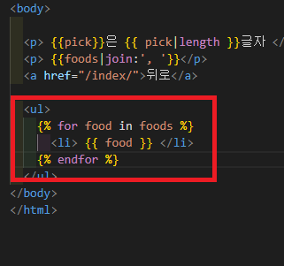

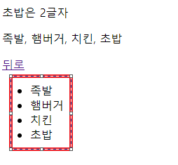


> 주석 사용

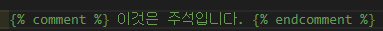

ctrl + / 사용


# 템플릿의 상속

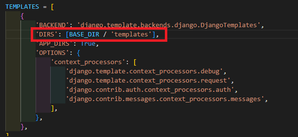

settings에서 BASE_DIR 설정해줌


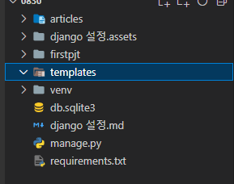

templates 디렉토리 생성해줌


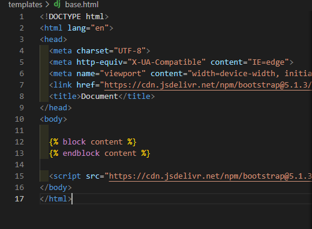

base.html


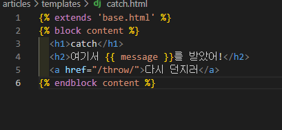


<DOCTYPE html> ~~ <html> 을 상속받고

   사이에 있는 부분만 작성하면 된다.


# urls.py를 프로젝트단 말고 개별 app단으로 옮기는 방법

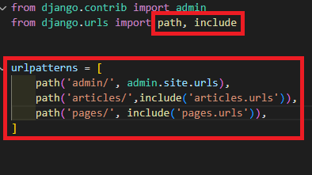

프로젝트단 urls.py


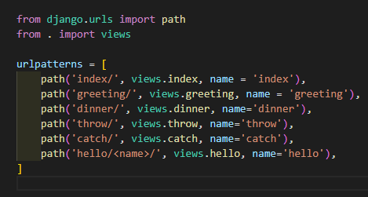

app(articles) 단의 urls.py


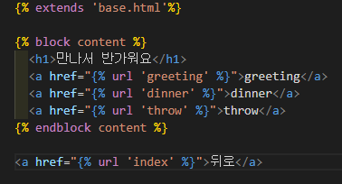

app(articles) 단의 index.html


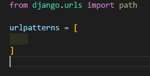

app(pages) 단의 urls.py  => 최소한 urlpatterns = [] 처럼 빈 리스트가 있어야 합니다.


