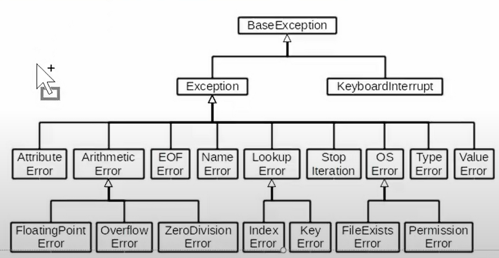

> 객체 지향 프로그래밍

객체 지향 프로그래밍은 컴퓨터 프로그래밍의 패러다임(방법론) 중 하나이다. 객체 지향 프로그래밍은 컴퓨터 프로그램을 명령어의 목록으로 보는 시각에서 벗어나 여러 개의 독립된 단위, 즉 "객체"들의 모임으로 파악하고자 하는 것이다. 각각의 객체는 메시지를 주고받고, 데이터를 처리할 수 있다.


> 절차지향 프로그래밍

Global data

ㄴ> function1

ㄴ> function2

ㄴ> function3

ㄴ> function4

.

.

.

하나가 바뀌면 사슬처럼 엮인 코드들을 전부 수정해야하는 복잡함이 있다.


> 객체지향 프로그래밍이 필요한 이유

1. 추상화 (현실세계가 너무 복잡.. 콘서트(무대, 가수, 감독, ... 으로 분리 ))
2. 상속
3. 다형성
4. 캡슐화


> 객체지향의 장점 / 단점

- 장점
  - 클래스 단위로 모듈화시켜 개발할 수 있으므로 많은 인원이 참여하는 대규모 소프트웨어 개발에 적합
  - 필요한 부분만 수정하기 쉽기 때문에 프로그램의 유지보수가 쉬움
- 단점
  - 설계 시 많은 노력과 시간이 필요함
    - 다양한 객체들의 상호 작용 구조를 만들기 위해 많은 시간과 노력이 필요
  - 실행 속도가 상대적으로 느림
    - 절차 지향 프로그래밍이 컴퓨터의 처리구조와 비슷해서 실행 속도가 빠름


## 객체 (컴퓨터 과학)

컴퓨터 과학에서 객체 또는 오브젝트(object)는 클래스에서 정의한 것을 토대로 메모리(실제 저장공간)에 할당된 것

- 객체(object)의 특징
  - 타입(type) : 어떤 연산자(operator)와 조작(method)이 가능한가?
  - 속성(attribute): 어떤 상태(데이터)를 가지는가
  - 조작법(method): 어떤 행위(함수)를 할 수 있는가?


코드 : 메서드

데이터

힙    : 객체

스택


## 객체와 인스턴스 (실제 메모리에 들어있는 것(주소가짐) : 인스턴스 / 그 메모리를 가리키는 것을 객체(변수)라고 함)

- 클래스로 만든 객체를 인스턴스 라고도 함
  - 객체와 인스턴스의 차이점?
    - 객체 : 정보 + 행동
    - 인스턴스 : (특정)<u>타입의, 클래스의</u> 인스턴스다
  - 이찬혁은 가수다 (O)
  - 이찬혁은 인스턴스다(X)
  - 이찬혁은 가수의 인스턴스다(O)


=> 객체는 특정 타입(클래스)의 인스턴스이다.


## 기본 문법

- 클래스 정의

```python
class MyClass:
    pass
```


- 인스턴스 생성

```python
my_instance = MyClass()
```


- 메서드 호출

```python
my_instance.my_method()
```


- 속성

```python
my_instance.my_attribute
```


## 클래스와 인스턴스 (붕어빵틀과 붕어빵)

- 클래스 : 객체들의 분류 / 설계도 (class)
- 인스턴스 : 하나하나의 실체 / 예 (instance)

```python
class Person:
    pass

print(type(Person)) # <class 'type'>

person1 = Person()

print(isinstance(person1, Person)) # True
print(type(person1)) # <class '__main__'.Person'>
```


## 객체 비교하기

- == (쌍둥이)
  - 동등한(equal)
  - 변수가 참조하는 객체가 동등한(내용이 같은) 경우 True
  - 두 객체가 같아 보이지만 실제로 동일한 대상을 가리키고 있다고 확인해 준것은 아님
- is (분신)
  - 동일한(identical)
  - 두 변수가 동일한 객체를 가리키는 경우 True


## 속성

- 특정 데이터 타입/클래스의 객체들이 가지게 될 상태/데이터를 의미
- 클래스 변수 / 인스턴스 변수가 존재

```python
class Person:
    blood_color = 'red' # 클래스 변수
    population = 100 # 클래스 변수
    
    def __init__(self, name):
        self.name = name # 인스턴스 변수
        
person1 = Person('지민')
print(person1.name) # 지민
```


### 클래스 변수

```python
class Circle():
    pi = 3.14 # 클래스 변수 정의
    
    def __init__(self, r):
        self.r = r #인스턴스 변수
    
c1 = Circle(5)
c2 = Circle(10)

print(Circle.pi) # 3.14 <- 클래스 변수 접근
print(c1.pi) # 3.14		<- 클래스 변수 접근
print(c2.pi) # 3.14

Circle.pi = 5			#<- 클래스 변수 할당 
print(Circle.pi) # 5
print(c1.pi) # 5
print(c2.pi) # 5
```


> 클래스 변수 활용

```python
class Person:
    count = 0
    # 인스턴스 변수 설정
    def __init__(self, name):
        self.name = name
        Person.count += 1
        
person1 = Person('아이유')
person2 = Person('이찬혁')

print(Person.count) # 2
```


### 인스턴스 변수

```python
class Person:
    
    def __init__(self, name, mbti): # 첫번째 파라미터는 무조건 self
        self.name = name
        self.mbti = mbti
        
john = Person('john')
print(john.name) # john         		<- 인스턴스 변수 접근
john.name = 'John Kim'				#   <- 인스턴스 변수 할당
print(john.name) # John Kim
```


> 클래스 변수와 인스턴스 변수

- 클래스 변수를 변경할 때는 항상 클래스.클래스변수 형식으로 변경

```python
class Circle():
    pi = 3.14
    
    def __init__(self, r):
        self.r = r # 인스턴스 변수
        
c1 = Circle(5)
c2 = Circle(10)

print(Circle.pi) # 3.14
print(c1.pi) # 3.14    <- 인스턴스 변수를 찾았는데 클래스 변수가 출력됨

Circle.pi = 5  #       <- 클래스 변수 변경
print(Circle.pi) # 5
print(c1.pi) # 5

c2.pi = 7 # 인스턴스 변수 변경
print(Circle.pi) # 5
print(c2.pi) # 7 (새로운 인스턴스 변수가 생성됨)

** 클래스 변수를 바꾸고 싶으면 (클래스.클래스변수), 인스턴스 변수를 바꾸고 싶으면 (인스턴스.인스턴스변수)
```


---

### 메서드

- 특정 데이터 타입/클래스의 객체에 공통적으로 적용 가능한 행위(함수)

```python
class Person:
    
    def talk(self):
        print('안녕')
    
   	def eat(sef, food):
        print(f'{food}를 냠냠')
        
person1 = Person()
person1.talk()
person1.eat('피자') # 피자를 냠냠
person1.eat('치킨') # 치킨를 냠냠
```


### 메서드의 종류

- 인스턴스 메서드 (인스턴스변수 처리, 개별 행동)
- 클래스 메서드 (클래스 처리)
- 정적 메서드 (나머지)


#### 인스턴스 메서드

- 인스턴스 변수를 사용하거나, 인스턴스 변수에 값을 설정하는 메서드
- 클래스 내부에 정의되는 메서드의 기본
- 호출 시, 첫번째 인자로 인스턴스 자기자신(self)이 전달됨

```python
class MyClass:
    
    def instance_method(self, arg1, ...): # 첫 번째 파라미터로 self가 있으면 instance 메서드
        
my_instance = MyClass()
my_instance.instance_method(...)
```


> self

- 인스턴스 자기 자신
- 파이썬에서 인스턴스 메서드는 호출 시 첫번째 인자로 인스턴스 자신이 전달되게 설계
  - 매개변수 이름으로 self를 첫 번째 인자로 정의
  - 다른 단어로 써도 작동하지만, 파이썬의 암묵적인 규칙


> 인스턴스 메서드 호출한 결과

```python
obj = MyClass()

print(obj.method())

print(MyClass.method(obj))
```


#### 생성자(construct) 메서드

- 인스턴스 객체가 생성될 때 자동으로 호출되는 메서드
- 인스턴스 변수들의 초기값을 설정
  - 인스턴스 생성
  - ______init______메서드 자동 호출

```python
class Person():
    
    def __init__(self):
        print('인스턴스가 생성되었습니다.')
        
person1 = Person() # 인스턴스가 생성되었습니다.
```

```python
class Person:
    
    def __init__(self, name):
        print(f'인스턴스가 생성되었습니다. {name}')
        
person1 = Person('지민') # 인스턴스가 생성되었습니다. 지민
```


#### 매직 메서드

- Double underscore(__) (더블언더 : 던더)가 있는 메서드는 특수한 동작을 위해 만들어진 메서드로, 스페셜 메서드 혹은 매직 메서드라고 불림

- 특정 상황에서 자동으로 불리는 메서드
- 예시
  - ______str______(self), ______len(self)______, ______repr______(slef)
  - ______lt______(self, other), ______le______(self, other), ______eq______(self, other)
  - ______gt______(self, other), ______ge______(self, other), ______ne______(self, other)


#### 소멸자(destructor) 메서드

- 인스턴스 객체가 소멸(파괴)되기 직전에 호출되는 메서드

```python
class Person:
    
    def __del__(self):
        print('인스턴스가 사라졌습니다.')
      
person1 = Person()
del person1 # 인스턴스가 사라졌습니다.
```


> 매직 메서드 예시

```python
class Circle:
    
    def __init__(self, r):
        self.r = r
        
    def area(self):
        return 3.14 * self.r * self.r
    
    def __str__(self):
        return f'[원] radius: {self.r}'
    
    def __gt__(self, other):
        return self.r > other.r
    
c1 = Circle(10)
c2 = Circle(1)

print(c1) # [원] radius : 10
print(c2) # [원] radius : 1
print(c1 > c2) # True
print(c1 < c2) # False
```


#### 클래스 메서드

- 클래스가 사용할 메서드
- @classmethod 데코레이터를 사용하여 정의
- 호출 시, 첫번째 인자로 클래스(cls)가 전달됨

```python
class MyClass:
    
    @classmethod
    def class_method(cls, arg1, ...):
MyClass.class_method(...)
```


> 클래스 메서드 활용

```python
class Person:
    count = 0 # 클래스 변수
    def __init__(self, name): # 인스턴스 변수 설정
        self.name = name
        Person.count += 1
        
    @classmethod
    def number_of_population(cls):
        print(f'인구수는 {cls.count}입니다.')
        
person1 = Person('아이유')
person2 = Person('이찬혁')
print(Person.count)
```


> 클래스 메서드 호출

- 클래스 자체에서 각 메서드를 호출하는 경우
  - 인스턴스 메서드는 호출할 수 없음

```python
print(MyClass.classmethod())

print(MyClass.staticmethod())

Myclass.method() # method() missing 1 required positional argument: 'self'  <- 클래스 자체에서 인스턴스 메서드 호출 불가능
```

- - 인스턴스는 클래스 메서드와 스태틱 메서드 모두 접근할 수 있음

```python
print(obj.classmethod()) # ('class method', <class '__main__.MyClass'>)

print(MyClass.classmethod()) # ('class method', <class '__main__.MyClass'>)

print(obj.staticmethod()) # static method
```


#### 데코레이터

- 함수를 어떤 함수로 꾸며서 새로운 기능을 부여
- @데코레이터(함수명) 형태로 함수 위에 작성
- 순서대로 적용 되기 때문에 작성 순서가 중요


> 데코레이터 사용 예시

- 데코레이터 없이 함수 꾸미기

```python
def hello():
    print("hello")
    
# 데코레이팅 함수
def add print(original): #파라미터로 함수를 받는다.
    def wrapper(): # 함수 내에서 새로운 함수 선언
        print("함수 시작") # 부가기능 -> original 함수를 꾸민다.
        original()
        print("함수 끝") # 부가기능 -> original 함수를 꾸민다
    return wrapper # 함수를 return 한다.

add_print(hello)()
# "함수 시작"
# hello
# "함수 끝"

print_hello = add_print(hello)
print_hello()
# "함수 시작"
# hello
# "함수 끝"
```


- 데코레이터 활용하여 함수 생성

```python
# 데코레이팅 함수
def add_print(original): # 파라미터로 함수를 받는다.
    def wrapper(): # 함수 내에서 새로운 함수 선언
        print("함수 시작") # 부가기능 -> original을 꾸민다.
        original()
        print("함수 끝") # 부가기능 -> original을 꾸민다.
    return wrapper # 함수를 return한다.
```

```python
@add_print # add_print를 사용해서 print_hello()함수를 꾸며주도록 하는 명령어
def print_hello():
    print("hello")
    
print_hello():
# "함수 시작"
# hello
# "함수 끝"
```


#### 클래스 메서드와 인스턴스 메서드

- 클래스 메서드 -> 클래스 변수 사용 (cls)
- 인스턴스 메서드 -> 인스턴스 변수 사용 (self)

- 그렇다면 인스턴스 변수, 클래스 변수 모두 사용하고 싶다면?
  - 클래스는 인스턴스 변수 사용이 불가능
  - 인스턴스 메서드는 클래스 변수, 인스턴스 변수 둘 다 사용이 가능


#### 스태틱 메서드

- 인스턴스 변수, 클래스 변수를 전혀 다루지 않는 메서드
- 언제 사용하는가 ? 
  - 속성을 다루지 않고 단지 기능만을 하는 메서드를 정의할 때 사용
- @staticmethod 데코레이터를 사용하여 정의


> 스태틱 메서드 사용 예시

```python
class Person:
    count = 0 # 클래스 변수
    def __init__(self, name): # 인스턴스 변수 설정
        self.name = name
        Person.count += 1
        
    @staticmethod
    def check_rich(money): # 스태틱은 cls, self 사용 x
        return money > 10000
    
person1 = Person('아이유')
person2 = Person('이찬혁')
print(Person.check_rich(100000)) # True 스태틱은 클래스로 접근 가능
print(person1.check_rich(100000)) # True 스태틱은 인스턴스로 접근 가능

```


#### 인스턴스와 클래스 간의 이름 공간(namespace)

- 클래스를 정의하면, 클래스와 해당하는 이름 공간 생성
- 인스턴스를 만들면, 인스턴스 객체가 생성되고 이름 공간 생성
- 인스턴스에서 특정 속성에 접근하면, 인스턴스-클래스 순으로 탐색

```python
# Person 정의

class Person:
    name = 'unknown'
    
    def talk(self):
        print(self.name)
        
p1 = Person()
p1.talk() # unknown

# p2 인스턴스 변수 설정 전/후
p2 = Person()
p2.talk() # unknown
p2.name = 'Kim'
p2.talk() # Kim

print(Person.name) # unknown
print(p1.name) # unknown
print(p2.name) # Kim
```


## 객체지향의 핵심 4가지

- 추상화 ( 변수, 함수, 클래스)

  - 현실 세계를 프로그램 설계에 반영

    - 복잡한 것은 숨기고, 필요한 것만 들어내기

    - > 추상화 예시

    - ```python
      # 학생 (Student)을 표현하기 위한 클래스를 생성합니다.
      
      class Student:
          def __init__(self, name, age, gpa):
              self.name = name
              self.age = age
              self.gpa = gpa
              
          def talk(self):
              print(f'반갑습니다. {self.name}입니다.')
          
          def study(self):
              self.gpa += 0.1
              
      ```

    - ```python
      # 교수(Professor)를 표현하기 위한 클래스를 생성합니다.
      
      class Professor:
          
          def __init__(self, name, age, department):
              self.name = name
              self.age = age
              self.department = department
              
          def talk(self):
              print(f'반갑습니다. {self.name}입니다.')
              
          def teach(self):
              self.age += 1
      ```

      

- 상속

  - 상속이란

    - 두 클래스 사이 부모-자식 관계를 정립하는 것

  - 클래스는 상속이 가능함

    - 모든 파이썬 클래스는 object를 상속 받음

  - ```python
    class ChildClass(ParentClass):
        pass
    ```

  - 하위 클래스는 상위 클래스에 정의된 속성, 행동, 관계 및 제약 조건을 모두 상속 받음

  - 부모클래스의 속성, 메서드가 자식 클래스에 상속되므로, 코드 재사용성이 높아짐

  - > 상속 없이 구현하는 경우

    ```python
    class Person:
        def __init__(self, name, age):
            self.name = name
            self.age = age
            
        def talk(self):
            print(f'반갑습니다. {self.name}입니다.')
            
    s1 = Person('김학생', 23)
    s1.talk() #반갑습니다. 김학생입니다.
    
    p1 = Person('박교수', 49)
    p1.talk() # 반갑습니다. 박교수입니다.
    
    s1.gpa = 4.5
    p1.department = '컴퓨터공학과'
    ```

  - > 상속을 통한 구현

    ```python
    class Person:
        def __init__(self, name, age):
            self.name = name
            self.age = age
            
        def talk(self):                               # <<=== 아래 하위 클래스에서 메서드 재활용 가능
            print(f'반갑습니다. {self.name}입니다.')       
    
    class Professor(Person):
        def __init__(self, name, age, department):
            self.name = name
            self.age = age
            self.department = department
            
    class Student(Person):
        def __init__(self, name, age, gpa):
            self.name = name
            self.age = age
            self.gpa = gpa
            
    p1 = Professor('박교수', 49, '컴퓨터공학과')
    s1 = Student('김학생', 23, 3.5)
    
    
    # 부모 Person 클래스의 talk 메서드를 활용
    p1.talk() # 반갑습니다. 박교수입니다.
    
    # 부모 Person 클래스의 talk 메서드를 활용
    s1.talk() #반갑습니다. 김학생입니다.
    
    ```

  - 상속 관련 함수와 메서드

    - isinstance(object, classinfo)

      - classinfo의 instance 거나 subclass*인 경우 True

      - ```python
        print(isinstance(p1, Person)) # True
        print(isinstance(p1, Professor)) #True
        print(isinstance(p1, Student)) # False
        ```

    - issubclass(class, classinfo)

      - class가 classinfo의 subclass이면 True

      - classinfo는 클래스 객체의 튜플일 수 있으며, classinfo의 모든 항목을 검사

      - ```python
        class Person:
            pass
        
        class Professor(Person):
            pass
        
        class Student(Person):
            pass
        
        print(issubclass(bool, int)) # True
        print(issubclass(float, int)) # False
        print(issubclass(Professor, Person)) # True
        print(issubclass(Professor, (Person,Student))) # True
        
        ```

    - super()

      - 자식클래스에서 부모클래스를 사용하고 싶은 경우

      - ```python
        class Studend(Person):
            def __init__(self, name, age, number, email, student_id):
                # Person 클래스
                super().__init__(name, age, number, email)
                self.student_id = student_id
        ```

    - 다중 상속

      - 두 개 이상의 클래스를 상속 받는 경우
      - 상속받은 모든 클래스의 요소를 활용 가능함
      - 중복된 속성이나 메서드가 있는 경우 상속 순서에 의해 결정됨 ( 앞이 먼저 )

  - 상속 관련 함수와 메서드

  - ```python
    # mro (Method Resolution Order) - 해당 인스턴스의 클래스가 어떤 부모 클래스를 가지는지 확인하는 메서드 (인스턴스 -> 자식 -> 부모로 확장)
    print(FirstChild.mro())
    ```

  - 

- 다형성

  - 다형성(Polymorphism) 이란?
    - 여러 모양을 뜻하는 그리스어
    - 동일한 메서드가 클래스에 따라 다르게 행동할 수 있음을 의미
    - 즉, 서로 다른 클래스에 속해있는 객체들이 동일한 메시지에 대해 다른 방식으로 응답할 수 있음
  - 메서드 오버라이딩
    - 상속받은 메서드를 재정의
      - 클래스 상속 시, 부모 클래스에서 정의한 메서드를 자식 클래스에서 변경
      - 부모 클래스의 메서드 이름과 기본 기능은 그대로 사용하지만, 특정 기능을 바꾸고 싶을 때 사용

- 캡슐화

  - 객체의 일부 구현 내용에 대해 외부로부터 직접적인 액세스를 차단

    - 예시: 주문등록번호

  - 파이썬에서 암묵적으로 존재하지만, 언어적으로는 존재하지 않음

  - > 접근제어자의 종류

    - Public Access Modifier (Public Member)

      - 언더바 없이 시작하는 메서드나 속성
      - 어디서나 호출이 가능, 하위 클래스 override 허용
      - 일반적으로 작성되는 메서드와 속성의 대다수를 차지

      

    - Protected Access Modifier

      - 언더바 1개로 시작하는 메서드나 속성

      - 암묵적 규칙에 의해 부모 클래스 내부와 자식 클래스에서만 호출 가능

      - 하위 클래스 override 허용

      - ```python
        def __init__(self, name, age):
            self.name = name
            self._age = age
        def get_age(self):
            return self._age
        ```

      - 

    - Private Access Modifier 

      - 언더바 2개로 시작하는 메서드나 속성

      - 본 클래스 내부에서만 사용이 가능

      - 하위클래스 상속 및 호출 불가능(오류)

      - 외부 호출 불가능(오류)

      - ```python
        def __init__(self, name, age):
            self.name = name
            self.__age = age
        def get_age(self):
            return self.__age
        ```

    - > getter 메서드와 setter 메서드

      - 변수에 접근할 수 있는 메서드를 별도로 생성

        - getter 메서드 : 변수의 값을 읽는 메서드
          - @property 데코레이터 사용
        - setter 메서드 : 변수의 값을 설정하는 성격의 메서드
          - @변수.setter 사용

      - ```python
        class Person:
            def __init__(self, age):
                self._age = age
                
            @property #<- 언더바가 없어도 get이 가능
            def age(self):
                return self.age
            
            @age.setter # <- 변수 할당 시 자동적용
            def age(self, new_age):
                if new_age <= 19:
                    raise ValueError('Too Young For SSAFY')
                    return
                
                self._age = new_age
                
        # 인스턴스를 만들어서 나이에 접근하면 정상적으로 출력 됩니다.
        p1 = Person(20)
        print(p1.age) # 20
        
        # p1 인스턴스의 나이를 다른 값으로 바꿔도 정상적으로 반영됩니다.
        p1.age = 33
        print(p1.age) # 33
        
        # setter 함수에는 "나이가 19살 이하면 안된다는" 조건문이 하나 걸려 있습니다.
        # 따라서 나이를 19살 이하인 값으로 변경하게 되면 오류가 발생합니다.
        p1.age = 19
        print(p1.age) # ValueError : Too Young For SSAFY
        ```


# 에러와 예외처리

> 개요
>
> - 디버깅
> - 에러와 예외
> - 예외 처리
> - 예외 발생 시키기





## 예외 처리

- try 문
  - 오류가 발생할 가능성이 있는 코드를 실행
  - 예외가 발생되지 않으면, except 없이 실행 종료

- except 절
  - 예외가 발생하면, except 절이 실행
  - 예외 상황을 처리하는 코드를 받아서 적절한 조치를 취함
- else
  - try문에서 예외가 발생하지 않으면 실행함
- finally
  - 예외 발생 여부와 관계없이 항상 실행함


- 에러 메세지 처리 (as)

  - 예외를 다른 이름에 대입

  - ```python
    try:
        empty_list = []
        print(empty_list[-1])
        
    except IndexError as err:
        print(f'{err}, 오류가 발생했습니다.')
        
    '''
    list index out of range, 오류가 발생했습니다.
    '''
    ```

  - 복수의 예외 처리 실습 (가장 작은 범주부터 예외처리를 해줘야 합니다.)

    ```python
    try:
        num = input('100으로 나눌 값을 입력하시오 : ')
        print(100/int(num))
    except ValueError:
        print('숫자를 넣어주세요')
    except ZeroDivisionError:
        print('0으로 나눌 수 없습니다.')
    except:
        print('에러는 모르지만 에러가 발생하였습니다.')
    ```


- 예외 처리 종합 예시

  - 파일을 열고 읽는 코드를 작성하는 경우

    - 파일 열기 시도
      - 파일 없는 경우 => "해당 파일이 없습니다." 출력 (except)
      - 파일이 있을 경우 => 파일 내용을 출력 (else)
    - 해당 파일 읽기 작업 종료 메시지 출력 (finally)

  - ```python
    # 파일이 없는 경우
    try:
        f = open('nooofile.txt')
    except FileNotFoundError:
        print('해당 파일이 없습니다.')
    else:
        print('파일을 읽기 시작합니다.')
        print(f.read())
        print('파일을 모두 읽었습니다.')
        f.close()
    finally:
        print('파일 읽기를 종료합니다.')
        
    '''
    해당 파일이 없습니다.
    파일 읽기를 종료합니다.
    '''
    ```

  - ```python
    # 파일이 존재하는 경우
    
    try:
        f = open('nooofile.txt')
    except FileNotFoundError:
        print('해당 파일이 없습니다.')
    else:
        print('파일을 읽기 시작합니다.')
        print(f.read())
        print('파일을 모두 읽었습니다.')
        f.close()
    finally:
        print('파일 읽기를 종료합니다.')
        
    '''
    파일을 읽기 시작합니다.
    파일내용
    파일을 모두 읽었습니다.
    파일 읽기를 종료합니다.
    '''
    ```

  - 